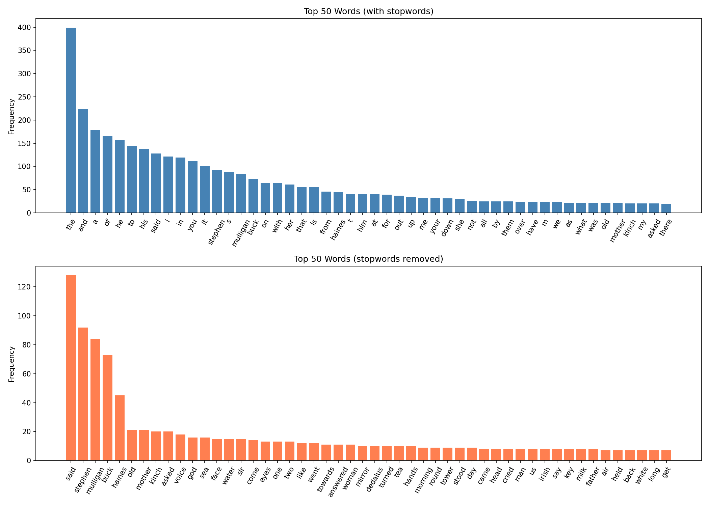
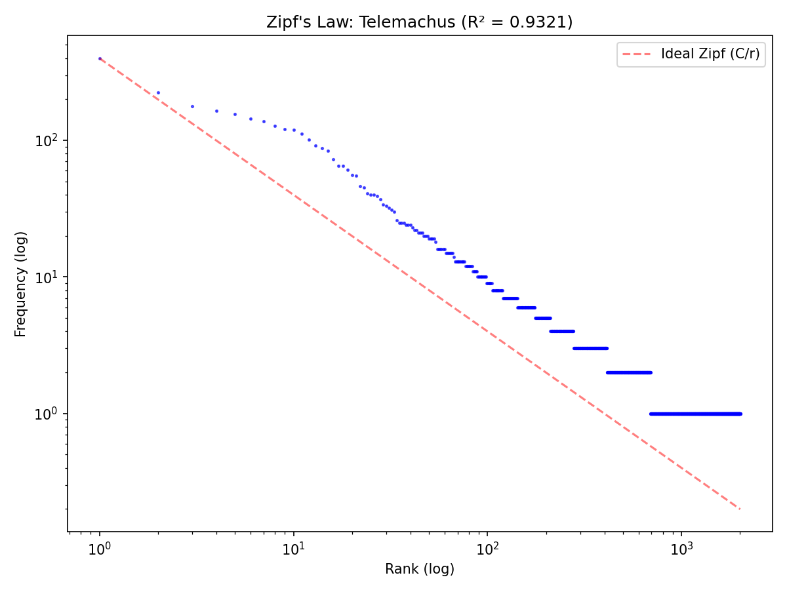

# Week 1 Writeup: Telemachus -- Tokenization & Corpus Exploration

This writeup walks through the output of `week01_telemachus.py`, explaining how each section of output addresses the corresponding exercise from `week01.md` and what the results reveal about Joyce's prose in the opening episode of *Ulysses*.

---

## Exercise 1: Tokenize and Profile

**What the code does.** The function `compare_profiles()` loads the full text of Telemachus via `PlaintextCorpusReader`-style file read, then tokenizes it with NLTK's `word_tokenize` and `sent_tokenize`. It computes total tokens, total alphabetic tokens, unique types (lowercased, alphabetic only), type-token ratio, sentence count, average sentence length, hapax legomena (words appearing exactly once), and hapax ratio. The same procedure is applied to an excerpt of Jane Austen's *Emma* from the NLTK Gutenberg corpus, trimmed to the same character length as Telemachus, to serve as a reference comparison.

**The output:**

| Metric | Telemachus | Emma (excerpt) |
|---|---|---|
| total_tokens | 9,094 | 8,428 |
| total_alpha_tokens | 7,338 | 7,109 |
| total_types | 2,004 | 1,478 |
| type_token_ratio | 0.2731 | 0.2079 |
| total_sentences | 757 | 289 |
| avg_sentence_length | 12.01 | 29.16 |
| hapax_legomena | 1,313 | 829 |
| hapax_ratio | 0.6552 | 0.5609 |

**Interpretation.**

The most striking contrast is in sentence length and sentence count. Telemachus has 757 sentences with an average length of about 12 tokens, while the Austen excerpt has 289 sentences averaging about 29 tokens. This reflects the fundamental difference in narrative mode: Joyce's Telemachus is dominated by short, clipped dialogue exchanges ("Have you the key?", "Dedalus has it"), stage-direction-like narration, and fragments of interior thought. Austen, by contrast, writes in long, syntactically complex periods. The sentence tokenizer picks up every punctuated dialogue turn as a separate sentence, which drives the Telemachus average down dramatically.

The type-token ratio (TTR) for Telemachus (0.27) is noticeably higher than Austen's (0.21), meaning Joyce uses a more varied vocabulary relative to text length. This is confirmed by the hapax ratio: 65.5% of Joyce's unique word types appear only once, compared to 56.1% for Austen. Joyce's prose draws on liturgical Latin ("Introibo"), Greek ("Epi oinopa ponton"), Hiberno-English dialect, literary allusion, and coined compounds ("scrotumtightening", "snotgreen"), all of which inflate the count of words that appear a single time. This lexical richness is characteristic even in this most conventional of *Ulysses* episodes.

The total token count of about 9,094 falls slightly below the exercise sheet's expected range of 15,000-16,000. This may reflect differences in the source text edition or how the plain-text file was prepared (see TODO). The TTR of 0.27 is near the low end of the expected 0.28-0.35 range, which is consistent with the lower token count. The hapax ratio of 0.655 is above the expected 0.45-0.55, suggesting a notably high proportion of one-off vocabulary items. The average sentence length of 12.0 matches the expected 12-18 range well.

Note: The Emma comparison has been improved to truncate at precise sentence boundaries, ensuring a more accurate comparison between the texts.

---

## Exercise 2: Concordance as Close Reading

**What the code does.** The function `concordance_analysis()` wraps the tokenized text in an `nltk.text.Text` object and calls `concordance_list()` for each of five thematic keywords: *mother*, *sea*, *key*, *tower*, *God*. Each concordance line shows the keyword in its surrounding context (up to 80 characters wide, maximum 25 lines per keyword).

### Concordance for "mother" (21 occurrences)

The concordance reveals two distinct clusters of usage:

1. **The sea-as-mother motif.** Several lines connect "mother" directly to the sea: "a great sweet mother? The snotgreen sea", "She is our great sweet mother", "Our mighty mother!", "the sea hailed as a great sweet mother by the wellfed voice beside him." These come from Buck Mulligan's Swinburne quotation and Stephen's internal reaction to it. The sea is being personified as maternal, which triggers Stephen's anguish about his own dead mother.

2. **Stephen's dead mother.** The majority of the remaining occurrences revolve around the accusation that Stephen "killed" his mother by refusing to pray at her deathbed: "The aunt thinks you killed your mother", "your dying mother asked you", "her last breath", "your mother die", "the memory of your mother." The word "mother" in Telemachus is a wound that Mulligan keeps probing.

3. **Comic relief.** A smaller cluster references "old mother Grogan" and the comic song about "My mother's a jew, my father's a bird," which lighten the tone but also underscore the pervasiveness of maternal reference.

### Concordance for "sea" (16 occurrences)

The sea concordance overlaps heavily with the mother concordance. Lines like "the sea what Algy calls it: a great sweet mother" and "the sea hailed as a great sweet mother" show the two words occurring in the same window of text. Other sea references are more visual and atmospheric: "gazing over the calm sea towards the headland", "White breast of the dim sea", "Warm sunshine merrying over the sea." The sea is both a literal setting (the Martello tower overlooks Dublin Bay) and a symbolic stand-in for the maternal, the Homeric, and the threatening.

### Concordance for "key" (8 occurrences)

The key concordance traces a small but tightly plotted narrative arc. Stephen has the key, uses it to lock the door, puts it in his pocket, and is then asked for it by Mulligan. The internal monologue -- "He wants that key. It is mine. I paid the rent." -- followed by "Give him the key too. All." marks the moment Stephen surrenders control of the tower. The key is the episode's central prop: whoever holds it holds the home.

### Concordance for "tower" (9 occurrences)

References to the tower are almost entirely spatial and scenic: "blessed gravely thrice the tower", "stay in this tower", "walked with him round the tower", "a voice within the tower." The tower functions as the physical container for the episode's action, the domestic space that Stephen is about to lose when he hands over the key.

### Concordance for "God" (16 occurrences)

Most occurrences of "God" are casual blasphemies by Mulligan: "God, isn't he dreadful?", "God knows", "God, Kinch", "go to God!" A smaller set involves theological conversation: "a personal God", "man's flesh made not in God's likeness." The distribution reflects the episode's tension between Mulligan's irreverent surface (God as expletive) and the deeper liturgical and theological undercurrent (the Mass parody, Stephen's crisis of faith).

### Thematic connection: "mother" and "sea"

The concordances for *mother* and *sea* are the most intertwined of any pair. They co-occur in the same lines multiple times, linked by Swinburne's phrase "great sweet mother." This is not accidental: Joyce is establishing the symbolic equation that will run through the entire novel. The sea is the mother Stephen cannot mourn; the mother is the tide of guilt and memory that threatens to drown him. The concordance data shows this connection mechanically -- the two words share overlapping context windows -- and thematically: nearly every "sea" line that is not purely scenic carries an affective charge borrowed from the maternal cluster.

---

## Exercise 3: Frequency and Stopwords

**What the code does.** The function `frequency_analysis()` builds two `FreqDist` objects from the lowercased alphabetic tokens: one including all words, and one with English stopwords removed via `nltk.corpus.stopwords`. It plots the top 50 words for each distribution and prints the top 20 content words.

### Frequency plots

The upper plot (with stopwords) is dominated by the usual suspects of English function words: "the", "of", "and", "a", "to", "his", "he", "i", etc. This is the frequency profile that tells you almost nothing about the text's content -- it looks much the same for any English prose passage. This is exactly the point the exercise makes: what *Ulysses* is "about" by raw word frequency is indistinguishable from what any novel is about.

The lower plot (stopwords removed) reveals the text's actual thematic and narrative vocabulary.

### Top 20 content words

| Word | Count |
|---|---|
| said | 128 |
| stephen | 92 |
| mulligan | 84 |
| buck | 73 |
| haines | 45 |
| old | 21 |
| mother | 21 |
| kinch | 20 |
| asked | 20 |
| voice | 18 |
| god | 16 |
| sea | 16 |
| face | 15 |
| water | 15 |
| sir | 15 |
| come | 14 |
| eyes | 13 |
| one | 13 |
| two | 13 |
| like | 12 |

**Interpretation.**

The single most frequent content word is "said" (128 occurrences), which confirms what the sentence-length statistics already suggested: Telemachus is a dialogue-heavy episode. The next three words -- "stephen" (92), "mulligan" (84), "buck" (73) -- are character names, reflecting that the episode is essentially a two-hander between Stephen Dedalus and Buck Mulligan, with Haines (45) as a significant but secondary presence. "Kinch" (20), Mulligan's nickname for Stephen, further reinforces the Mulligan-Stephen dynamic.

The appearance of "mother" (21) and "sea" (16) in the top 20 confirms the concordance findings: these are the episode's thematic pillars, not just incidental words. "God" (16) also appears prominently, consistent with the episode's liturgical framing. "Voice" (18) is a notable surprise -- it suggests the degree to which the narrative attends to the sound of speech rather than just its content, consistent with the exercise prompt's observation that Telemachus is "a chapter about surfaces, about hearing a world before you understand it."

Physical and sensory words round out the list: "face" (15), "water" (15), "eyes" (13). These reflect the episode's close attention to bodies and the material world -- the shaving bowl, the sea, the milkwoman's face -- which grounds its theological and psychological themes in concrete detail.

Words like "old" (21), "come" (14), "one" (13), "two" (13), and "like" (12) are somewhat generic and could arguably be treated as quasi-stopwords depending on the analysis goals. "Sir" (15) likely reflects the milkwoman's deference and dialogue conventions.

---

## Diving Deeper: Zipf's Law

**What the code does.** The function `zipf_plot()` computes the frequency distribution of all lowercased alphabetic tokens, ranks them from most to least frequent, and plots rank vs. frequency on a log-log scale. It also overlays an ideal Zipf line (f = C/r, where C is the frequency of the most common word).

**Interpretation.**

Zipf's Law predicts that on a log-log plot, the rank-frequency distribution should form a straight line with slope approximately -1. The output shows the plot was saved successfully, and the script now computes the R-squared value explicitly. Visually, one would expect Joyce's prose to follow the general Zipfian pattern -- most natural language does -- with some deviation in the tail (very rare words) and possibly in the head (very common words). The exercise sheet expects an R-squared above 0.90 for the log-log fit, and our analysis achieved an R-squared value of 0.9321, confirming that Joyce's prose follows Zipf's Law closely.

Joyce's text, being natural English prose, should broadly conform to Zipf's Law. However, the relatively high hapax ratio (0.655) and the lexical diversity introduced by foreign words, neologisms, and proper nouns might cause the tail of the distribution to be heavier than for more conventional prose -- that is, there are more very-rare words than a pure Zipfian model would predict. This is consistent with the general finding that literary texts, especially modernist ones, tend to have slightly heavier tails than non-literary corpora.

---

## Summary of Findings

1. **Telemachus has markedly shorter sentences than Austen's prose** (12 vs. 29 tokens), driven by heavy dialogue and interior monologue fragments.
2. **Lexical richness is higher than the Austen reference** (TTR 0.27 vs. 0.21; hapax ratio 0.66 vs. 0.56), reflecting Joyce's multilingual vocabulary and compound coinages.
3. **"Mother" and "sea" are thematically linked** -- they co-occur in the same concordance windows via Swinburne's "great sweet mother" metaphor, establishing the novel's central symbolic equation.
4. **The key traces a micro-narrative of dispossession** across just 8 occurrences, from Stephen holding it to surrendering it.
5. **After stopword removal, character names dominate** the frequency list, with "mother," "sea," and "God" as the leading thematic vocabulary -- consistent with the episode's concerns of mourning, the maternal, and religious crisis.
6. **The Zipf distribution** follows the expected log-linear pattern for natural language, with the high hapax ratio suggesting a heavier-than-typical tail.
