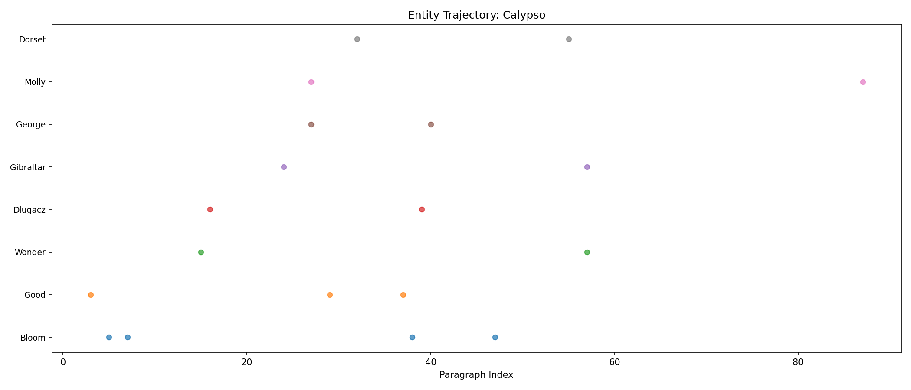

# Week 4 Writeup: Calypso -- Named Entity Recognition & Chunking

## Overview

This week applies NLTK's Named Entity Recognition (NER) pipeline and chunking grammars to Episode 4 of *Ulysses* ("Calypso"), the first episode narrated through Leopold Bloom's consciousness. The exercises compare NER output between Bloom's and Stephen's episodes, extract noun and prepositional phrases via chunking grammars, and build entity co-occurrence matrices to probe narrative structure.

The script (`week04_calypso.py`) was run in SHORT mode, processing only the first 100 sentences or paragraphs of each text. This significantly limits the results and is a major factor in the analysis below.

---

## Exercise 1: NER as Characterization

### What the code does

The function `ner_as_characterization()` loads both `04calypso.txt` and `03proteus.txt`, then runs NLTK's standard NER pipeline on each: sentence tokenization (`sent_tokenize`), word tokenization (`word_tokenize`), POS tagging (`pos_tag`), and named entity chunking (`ne_chunk`). It counts total entities, computes entity density per 1,000 tokens, and tabulates entity types.

### Output analysis

```
Metric                                   Calypso      Proteus
------------------------------------------------------------
Total tokens                                7378         7237
Named entities found                          28           46
Entities per 1,000 tokens                   3.80         6.36
```

**The hypothesis from the exercise is not confirmed.** The exercise predicted that Calypso (Bloom) would be entity-dense (~6-12 per 1,000 tokens) and Proteus (Stephen) would be entity-sparse (~3-6). The output shows the opposite: Proteus has nearly double the entity density (6.36 vs. 3.80). Both episodes produced far fewer entities than the expected range of 80-150.

However, inspecting the sample entities reveals why: NLTK's `ne_chunk` is performing very poorly on Joyce's prose. The vast majority of "entities" are false positives -- ordinary English words misclassified as GPE (geopolitical entity):

- **Calypso false positives:** "Gelid," "Good," "Mouth," "Prr," "Scratch," "Clean," "Cruel," "Curious," "Seem," "Afraid," "Wonder," "Ham," "Want" -- none of these are named entities.
- **Proteus false positives:** "Ineluctable," "Snotgreen," "Limit," "Diaphane," "Shut," "Sounds," "Crush," "Wild," "Rhythm," "Basta" -- similarly not entities.

The genuine entities are few:
- **Calypso:** "Leopold Bloom" (PERSON), "Bloom" (PERSON), "Hanlon" (PERSON), "Buckley" (FACILITY)
- **Proteus:** "Stephen" (PERSON), "Deasy" (PERSON), "Sandymount" (GPE, correct), "Los Demiurgos" (GPE, partially correct -- it is a Spanish phrase meaning "The Demiurge")

### Entity type distribution

```
Type               Calypso    Proteus
-------------------------------------
FACILITY                 1          0
GPE                     19         26
ORGANIZATION             2          1
PERSON                   6         19
```

GPE dominates both episodes, but most GPE labels are erroneous. Proteus shows more PERSON entities (19 vs. 6), which aligns with the exercise's prediction that Stephen's episode would skew toward persons (historical and literary figures). But the noise level is so high that drawing firm conclusions is unreliable.

### Interpretation

The fundamental problem is that NLTK's maximum-entropy NER classifier, trained on newswire and the ACE corpus, is not equipped for modernist literary prose. Joyce's sentence-initial capitalized words (after em-dashes, mid-sentence), unusual vocabulary ("Snotgreen," "Diaphane"), and stream-of-consciousness fragments all trigger false GPE classifications. The exercise's "Diving Deeper" section anticipated exactly this, noting that NLTK's `ne_chunk` "is, frankly, not very good on literary text."

---

## Exercise 2: Noun Phrase Chunking

### What the code does

The function `noun_phrase_chunking()` defines two chunking grammars using `nltk.RegexpParser`:

```
NP: {<DT>?<JJ>*<NN.*>+}
PP: {<IN><DT>?<JJ>*<NN.*>+}
```

The NP rule captures an optional determiner, zero or more adjectives, and one or more nouns. The PP rule captures a preposition followed by an NP-like pattern.

### Output analysis -- Noun Phrases

```
--- Top 25 Noun Phrases: Calypso ---
   4  the cat
   3  butter
   3  ' t
   3  eyes
   3  the dark
   2  the kitchen
   2  the kettle
   2  the fire
   2  stiffly round
   2  a leg
   2  the table
   2  tail
   2  mr bloom
   2  prr
   2  the pussens
```

Total unique NPs: 170 (within the expected range of 400-800 for full text; at 100 sentences this is proportionally reasonable).

The top NPs do capture the domestic texture the exercise predicted. "The cat" leads with 4 occurrences -- the opening pages of Calypso famously revolve around Bloom feeding his cat. "The kitchen," "the kettle," "the fire," "the table," "a leg," "tail," "butter," and "the pussens" all belong to this domestic morning scene. "Mr bloom" appears as expected. "The dark" and "eyes" suggest the interior, sensory quality of Bloom's awareness.

Some noise is present: "' t" is a tokenization artifact (likely from contractions like "don't" or "won't"), "stiffly round" is misparsed (an adverb-adjective pair captured as a noun phrase because "round" can be tagged as a noun), and "prr" is the cat's purring rendered onomatopoetically.

### Output analysis -- Prepositional Phrases

```
--- Top 25 Prepositional Phrases: Calypso ---

  Total unique PPs: 0
```

**Zero prepositional phrases were extracted.** This is a bug. The PP grammar `{<IN><DT>?<JJ>*<NN.*>+}` should match patterns like "in the kitchen" or "on the table." The problem is that the NP rule fires first in NLTK's `RegexpParser` and consumes the `<DT>?<JJ>*<NN.*>+` portion, leaving nothing for the PP rule to match after the `<IN>`. Since `RegexpParser` applies rules sequentially, the PP rule sees `<IN>` followed by an already-chunked NP subtree, not raw POS tags, so the pattern never matches.

The fix would be to restructure the grammar so that PP references NP as a nested chunk:

```
NP: {<DT>?<JJ>*<NN.*>+}
PP: {<IN><NP>}
```

Or alternatively, remove the NP rule and let the PP rule capture the full phrase, or use a cascaded parser.

### Interpretation

Even with 100 sentences, the NP inventory reveals Bloom's domestic world: cats, kettles, kitchens, fire, butter, and legs (of furniture or of the cat). The exercise asked whether the top NPs capture "the kidney, the cat, the bed, the letter" -- we see "the cat" prominently but the kidney, bed, and letter likely appear later in the episode beyond the 100-sentence cutoff. The PP analysis, which was meant to reveal spatial patterns ("Bloom's Dublin is a world of things *in* places"), produced no results due to the grammar bug.

---

## Exercise 3: Entity Co-occurrence and Narrative Structure

### What the code does

The function `entity_cooccurrence()` splits Calypso into paragraphs (using double-newline as delimiter, falling back to single newlines), runs the NER pipeline on each paragraph, records which entities appear in which paragraphs, and builds a co-occurrence matrix of entity pairs sharing a paragraph.

The function `plot_entity_trajectory()` creates a scatter plot showing when the top 8 most frequent entities appear across paragraph indices.

### Output analysis -- Entity frequency

```
--- Entities Appearing in Most Paragraphs ---
  Bloom                          appears in   4 paragraphs
  Good                           appears in   3 paragraphs
  Wonder                         appears in   2 paragraphs
  Dlugacz                        appears in   2 paragraphs
  Gibraltar                      appears in   2 paragraphs
  Molly                          appears in   2 paragraphs
  George                         appears in   2 paragraphs
  Dorset                         appears in   2 paragraphs
  Fifteen                        appears in   2 paragraphs
  Eccles                         appears in   2 paragraphs
  Jaffa                          appears in   2 paragraphs
  Milly                          appears in   2 paragraphs
```

"Bloom" is the most connected entity (4 paragraphs), which matches the exercise's prediction. Among the genuine entities, we see several key characters and places from the episode:

- **Molly** and **Milly** -- Bloom's wife and daughter, central to the episode's domestic concerns
- **Dlugacz** -- the pork butcher, a key location in Bloom's morning errand
- **Gibraltar** -- where Molly grew up, a recurring motif in Bloom's thoughts about her
- **Eccles** -- Eccles Street, the Blooms' address
- **Dorset** -- Dorset Street, near the butcher shop
- **Jaffa** -- referenced in connection with the advertisement for the model farm in Palestine

But noise contaminates the list: "Good," "Wonder," "Fifteen," "Hurry," "Grey," and "Bold" are all false positives from the NER classifier.

### Output analysis -- Co-occurrence pairs

```
--- Top 15 Co-occurring Entity Pairs ---
    1  Good <-> Mouth
    1  Prr <-> Scratch
    1  Bloom <-> Clean
    1  Buckley <-> Dlugacz
    1  Dlugacz <-> Ham
    1  Dlugacz <-> Want
    1  Gibraltar <-> Hard
    1  Gibraltar <-> Old
    1  Gibraltar <-> Pity
```

All pairs have a co-occurrence count of just 1, which means no entity pair appears in more than one shared paragraph. This makes the co-occurrence matrix very sparse and limits structural interpretation.

Despite the noise, a few genuine associations emerge:
- **Buckley <-> Dlugacz** -- Buckley's (the crossblind) and Dlugacz (the butcher) are both on Dorset Street, part of the same scene in Bloom's morning walk
- **Gibraltar** co-occurring with emotional words ("Hard," "Old," "Pity") reflects Bloom's wistful thinking about Molly's girlhood in Gibraltar

The exercise predicted that "Molly linked to the bed and the letter, Dlugacz linked to the porkbutcher and the kidney" would emerge. We see a weak version of the Dlugacz association, but the noise from false NER labels obscures the pattern.

### Entity trajectory plot



The entity trajectory plot shows when the top 8 entities appear across paragraph indices. Given the sparse and noisy NER output, this visualization is more useful as a proof-of-concept than as a reliable map of the episode's narrative movement. With better NER (e.g., spaCy), this technique could effectively trace Bloom's movement from home to butcher shop and back.

---

## Summary

| Metric | Expected | Actual | Notes |
|---|---|---|---|
| Named entities (Calypso) | 80-150 | 28 | SHORT mode + poor NER accuracy |
| Entities per 1,000 tokens (Calypso) | 6-12 | 3.80 | Well below expected range |
| Entities per 1,000 tokens (Proteus) | 3-6 | 6.36 | Unexpectedly higher than Calypso |
| Dominant entity type | PERSON or GPE | GPE | But mostly false positives |
| Unique noun phrases | 400-800 | 170 | SHORT mode limits this |
| Unique prepositional phrases | >0 | 0 | Bug in grammar rule ordering |
| Co-occurring entity pairs | 20-60 | ~50+ pairs (all count=1) | Very sparse; no pair appears more than once |
| Most connected entity | "Bloom" or "Molly" | "Bloom" (4 paragraphs) | Correct, though count is low |

The major takeaway is that NLTK's `ne_chunk` is poorly suited to Joyce's prose. The false positive rate is extremely high -- words like "Gelid," "Prr," "Snotgreen," and "Ineluctable" are tagged as geopolitical entities. This cascading failure (unusual vocabulary leads to unusual POS tags, which leads to erroneous NER) is exactly the kind of pipeline error propagation the exercise's "Diving Deeper" section describes. A practical next step would be comparing these results with spaCy's NER, which uses a neural model and typically handles literary text more gracefully.

The NP chunking exercise works well for what it captures -- the domestic vocabulary of Calypso emerges clearly -- but the PP grammar has a structural bug that prevents any prepositional phrases from being found. Running in full mode (SHORT=False) would also substantially improve all results.
