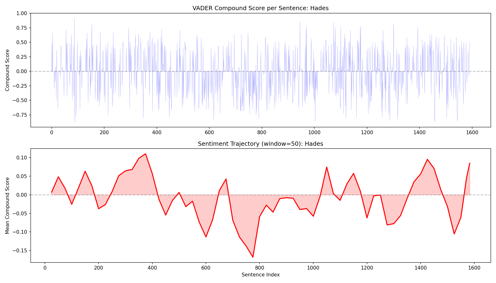

# Week 6 Writeup: Hades -- Sentiment Analysis and Affective Lexicons

## Overview

This week applies VADER sentiment analysis and SentiWordNet affective lexicons to Episode 6 ("Hades") of James Joyce's *Ulysses*. The episode follows Leopold Bloom in a funeral carriage to Glasnevin Cemetery for Paddy Dignam's burial. The exercise uses Hades as a diagnostic case for sentiment analysis tools: a chapter about death that *should* score as uniformly negative, but whose tonal complexity -- dark humor, practical curiosity, tenderness, banality -- resists that flattening. The script (`week06_hades.py`) addresses three exercises: plotting a VADER sentiment trajectory, comparing dialogue and narration registers, and interrogating SentiWordNet's context-free scoring on death-related and proximity words.

---

## Exercise 1: Sentiment Trajectory

### What the code does

The function `sentiment_trajectory()` uses NLTK's `SentimentIntensityAnalyzer` (VADER) to compute a compound polarity score for every sentence in Hades, then smooths these scores using a sliding window of 50 sentences (with half-window step size of 25). It generates a two-panel plot saved as `week06_sentiment.png`: the top panel shows raw per-sentence compound scores, and the bottom panel shows the smoothed trajectory. It also computes summary statistics and identifies the five most positive and five most negative sentences.

### Output and interpretation

**Summary statistics:**

| Metric | Value | Expected Range (from exercise) |
|---|---|---|
| Total sentences | 1,592 | -- |
| Mean compound score | -0.0089 | -0.05 to -0.15 |
| Variance | 0.0820 | 0.15 to 0.30 |
| Positive sentences | 309 (19.4%) | 25-35% |
| Negative sentences | 319 (20.0%) | 30-40% |
| Neutral sentences | 964 (60.6%) | -- |

The mean compound score of -0.0089 is barely negative -- much closer to zero than the exercise's expected range of -0.05 to -0.15. This already tells us something important: VADER does not "see" Hades as a particularly negative episode. The variance of 0.082 also falls well below the expected 0.15-0.30, suggesting VADER is not registering the full range of tonal shifts in the text.

The dominance of neutral sentences (60.6%) is striking. Most of Joyce's prose in Hades consists of short, clipped interior fragments and spare narration that lack the explicit sentiment vocabulary VADER was trained to detect. VADER, designed for social media text where sentiment is typically overt, reads much of Joyce's restrained, allusive prose as neutral.

The positive and negative sentence percentages (19.4% and 20.0%) are almost symmetrical and both below the exercise's expected ranges. This near-balance is itself revealing: even in a funeral chapter, VADER finds almost as many "positive" sentences as "negative" ones.

### VADER misfires (most positive sentences)

The output identifies five sentences VADER scores as highly positive, all of which are misfires in the funeral context:

1. **[+0.911] "But with the help of God and His blessed mother I'll make it my business to write a letter..."** -- VADER reads "God," "blessed," and "help" as strong positive signals. In context, this is dialogue from the funeral gathering, not an expression of joy.

2. **[+0.856] "Said he was going to paradise or is in paradise."** -- "Paradise" drives a high positive score, but the sentence refers to the afterlife destination of the dead man. The religious consolation is tinged with the very fact of death.

3. **[+0.836] "Rewarded by smiles he fell back and spoke with Corny Kelleher..."** -- "Rewarded" and "smiles" trigger VADER's positive lexicon, but this is mundane funeral logistics.

4. **[+0.821] "Hoping you're well and not in hell."** -- A dark joke. VADER picks up "well" and "hoping" as positive, misses the gallows humor entirely. This is one of Joyce's characteristic tonal moves: genuine sentiment and comic deflation in the same breath.

5. **[+0.813] "But I wish Mrs Fleming had darned these socks better."** -- "Wish" and "better" read as positive to VADER. In context, this is Bloom's banal domestic thought intruding on the funeral solemnity -- a classic Bloomian deflection.

### Most negative sentences

1. **[-0.872] "I won't have her bastard of a nephew ruin my son."** -- Correctly identified as negative; "bastard" and "ruin" carry strong negative valence.

2. **[-0.866] "Silly-Milly burying the little dead bird in the kitchen matchbox..."** -- VADER reads "dead" and the overall word pattern as negative. In Joyce's text, this is a tender memory of childhood -- Milly's innocent encounter with death. The sentiment is bittersweet, not simply negative.

3. **[-0.863] "Once you are dead you are dead."** -- VADER correctly scores the lexical content, but misses that Bloom's blunt pragmatism here is more stoic than mournful.

4. **[-0.859] "There is another world after death named hell."** -- "Death" and "hell" drive the score. In context, Bloom is rehearsing religious propositions with detached curiosity, not expressing anguish.

5. **[-0.852] "Devil in that picture of sinner's death showing him a woman."** -- "Devil," "sinner's," and "death" load the negative side. Again, Bloom is observing and cataloging rather than emoting.

A pattern emerges: VADER correctly identifies lexical polarity but misses the *stance* of the speaker. Bloom's characteristic mode is detached observation -- he notes death, hell, and decay without the emotional investment those words typically carry.

---

## Exercise 2: Bloom's Stoicism vs. the Narrator's Register

### What the code does

The function `split_interior_exterior()` uses a heuristic to separate dialogue (lines beginning with em-dashes or double-dashes) from narration/interior monologue (everything else). The function `compare_registers()` then applies VADER to each stream independently, computing mean compound scores and variance for both.

### Output and interpretation

| Register | Sentences | Mean Compound | Variance |
|---|---|---|---|
| Dialogue | 276 | +0.0048 | 0.0763 |
| Narration/Interior | 1,316 | -0.0126 | 0.0830 |
| **Variance ratio** | | | **1.09** |

The exercise predicted that interior monologue would be more tonally variable than dialogue, and the variance ratio of 1.09 confirms this -- though only barely. The narration/interior stream has slightly higher variance (0.083 vs. 0.076) and a slightly more negative mean (-0.013 vs. +0.005).

The dialogue's near-zero positive mean (+0.005) reflects the social conventions of funeral conversation: people say comforting, polite things at funerals, and VADER picks up on the surface politeness. The narration/interior's slightly negative lean captures the darker undertow of Bloom's private thoughts.

However, several caveats apply:

- **The segmentation is crude.** The heuristic splits on em-dashes, which captures dialogue but lumps together third-person narration and Bloom's interior monologue into a single "narration/interior" category. The exercise specifically asked for interior monologue vs. external narration, but distinguishing these in Joyce (especially in an episode that uses the "initial style" of the first six episodes, where free indirect discourse blurs the boundary) is extremely difficult to automate.

- **The variance ratio is modest.** The expected ratio was > 1.0, and it is -- but at 1.09 it is only marginally above 1. This may reflect the segmentation problem: the narration category is diluted by external description, which would dampen the variance that a pure interior-monologue stream might show.

- **Features that confuse VADER in Bloom's interior language** include: short sentence fragments that lack enough context for VADER to score (contributing to the neutral mass), rhetorical questions, dark jokes where positive words appear in negative contexts, and practical observations about death (decomposition chemistry, coffin pricing) that use technical or neutral vocabulary for emotionally charged subjects.

---

## Exercise 3: Death Lexicon

### What the code does

The function `death_lexicon_analysis()` looks up 20 death-related words and 14 proximity words in SentiWordNet, printing the positive, negative, and objective scores for the first synset of each word.

### Output and interpretation

**Death words:**

The most notable finding is that the *majority* of death words score as entirely objective (1.000) with zero positive or negative sentiment:

- **coffin, cemetery, grave, corpse, funeral, burial, death, dead, hearse, skeleton, ashes**: all score 0.000 positive, 0.000 negative, 1.000 objective.

This is remarkable and counterintuitive. SentiWordNet treats these words as purely descriptive -- as if "coffin" and "corpse" carry no affective weight. Only a subset of death words register any negativity:

| Word | Neg Score | Synset |
|---|---|---|
| mourning | 0.375 | mourning.n.01 |
| decay | 0.375 | decay.n.01 |
| dying | 0.625 | death.n.04 |
| tomb | 0.125 | grave.n.02 |
| widow | 0.125 | widow.n.01 |
| grief | 0.625 | grief.n.01 |
| loss | 0.250 | loss.n.01 |
| weep | 0.750 | cry.v.02 |
| sorrow | 0.625 | sorrow.n.01 |

The pattern: words that describe *emotional responses* to death (grief, sorrow, weep, mourning) carry negative sentiment, while words that describe the *physical facts* of death (coffin, corpse, grave, cemetery) are scored as objective. SentiWordNet's annotations appear to follow a strict denotation-based logic: a coffin is just a box; it is the context that makes it sad.

The average negativity of death words is 0.194 -- at the low end of the exercise's expected 0.2-0.5 range, precisely because so many core death words score as neutral.

**Proximity words:**

Most proximity words also score as objective (1.000), with a few exceptions:

| Word | Pos Score | Synset |
|---|---|---|
| warm | 0.250 | warm.v.01 |
| peace | 0.125 | peace.n.01 |
| gentle | 0.875 | pacify.v.01 |
| soft | 0.000 (neg: 0.250) | soft.a.01 |

The average positivity of proximity words is 0.089. The key insight, printed by the script itself, is that words like "rest," "sleep," and "peace" score as positive or neutral in SentiWordNet, but in the funeral context of Hades they are euphemisms for death. "He is at rest" means "he is dead." "Sleeping" means "in the grave." A context-free lexicon cannot capture this semantic shift.

The word "bloom" itself is scored as purely objective (blooming.n.01, 1.000), which is a delightful accident: Leopold Bloom, whose very name evokes growth and life, moves through the territory of death. SentiWordNet sees only the botanical denotation.

### Reflection on "correct" sentiment analysis

The exercise asks what a "correct" sentiment analysis of a funeral chapter would even mean. The output demonstrates the problem from multiple angles:

- VADER's mean score of -0.009 suggests Hades is tonally flat and almost neutral. A human reader knows it is anything but.
- SentiWordNet scores "coffin" and "death" as objective, which is technically defensible but emotionally absurd in this context.
- The most "positive" sentences are often the darkest in context (paradise as afterlife, dark jokes about hell).
- The most "negative" sentences are sometimes the most tender (Milly burying the dead bird).

The fundamental mismatch is between *lexical sentiment* (what individual words typically connote) and *textual affect* (what the passage makes a reader feel). Joyce's genius in Hades is precisely that he decouples these: neutral words carry enormous emotional weight, positive words appear in devastating contexts, and the overall tone is one that no single polarity label can capture. A "correct" sentiment analysis would need to model not just word-level valence but speaker stance, contextual reframing, irony, and the reader's accumulated knowledge of Bloom's inner life -- capabilities well beyond any current lexicon-based tool.

---

## Methods Summary

| NLTK Component | Usage |
|---|---|
| `nltk.sentiment.vader.SentimentIntensityAnalyzer` | Per-sentence compound polarity scoring for Exercises 1 and 2 |
| `nltk.tokenize.sent_tokenize` | Sentence segmentation for all exercises |
| `nltk.corpus.sentiwordnet.senti_synsets()` | Looking up positive, negative, and objective scores for individual words (Exercise 3) |
| `matplotlib.pyplot` | Two-panel sentiment trajectory plot (Exercise 1) |

---

## Comparison to Exercise Targets

| Metric | Expected | Actual | Notes |
|---|---|---|---|
| Mean VADER compound | -0.05 to -0.15 | -0.009 | Much less negative than expected; VADER sees Hades as nearly neutral |
| Variance | 0.15-0.30 | 0.082 | Below expected; many neutral-scored sentences compress variance |
| % positive | 25-35% | 19.4% | Below expected |
| % negative | 30-40% | 20.0% | Below expected |
| Variance ratio (interior/dialogue) | > 1.0 | 1.09 | Just above threshold; segmentation heuristic is coarse |
| SentiWordNet avg negativity (death words) | 0.2-0.5 | 0.194 | At floor of expected range |
| VADER misfires identified | >= 3 | 5 positive + 5 negative shown | Met |
