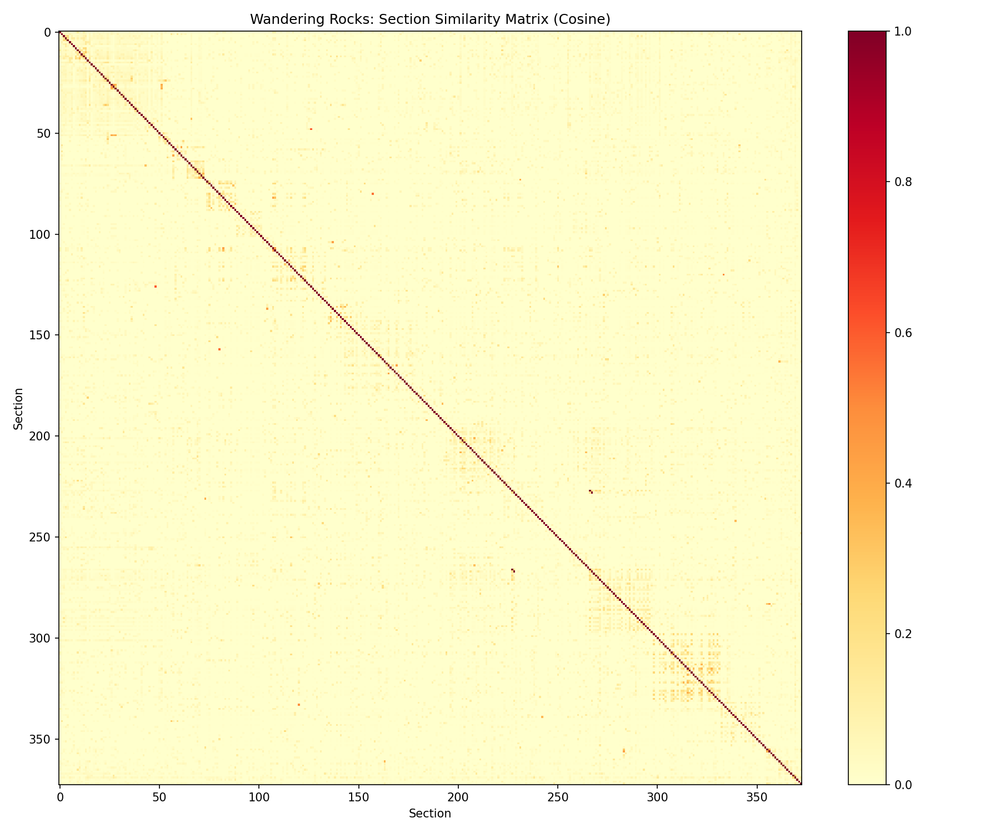

# Week 10 Writeup: Wandering Rocks -- Text Similarity & Document Clustering

## Overview

This week applies TF-IDF similarity, anomaly detection, and named entity tracking to Episode 10 of *Ulysses*, "Wandering Rocks." The episode consists of 19 short sections, each following a different Dubliner through the city at roughly the same time on the afternoon of June 16, 1904. Joyce threads the sections together with brief *interpolations* -- sentences from one section that intrude into another to mark simultaneous events elsewhere in the city.

The Python solution (`week10_wanderingrocks.py`) implements three exercises: (1) a TF-IDF cosine similarity matrix across sections, (2) interpolation detection by scoring sentences against their section centroid, and (3) named entity tracking across sections to reveal the episode's architectural plan.

**Critical caveat:** The section splitter (`split_wandering_rocks`) parsed **373 sections** instead of the intended 19. The function splits on double newlines and merges segments shorter than 50 characters, but this heuristic produces paragraph-level chunks rather than the 19 narrative sections Joyce designed. This means all downstream results -- the similarity matrix, the interpolation detector, and the entity tracker -- operate on paragraphs, not on the episode's true structural units. The analysis below interprets the output as-is, but the results should be understood in light of this fundamental segmentation error.

---

## Exercise 1: Section Similarity Matrix

### What the code does

The `tfidf_vectors()` function tokenizes each section with `nltk.tokenize.word_tokenize`, filters to alphabetic tokens longer than 2 characters that are not in `nltk.corpus.stopwords`, computes term frequency normalized by section length, and multiplies by the inverse document frequency (log(N / df)) to produce a sparse TF-IDF vector for each section. The `cosine_similarity()` function computes the dot product of two sparse vectors divided by the product of their magnitudes. The `similarity_matrix()` function fills an N x N matrix (here 373 x 373) with pairwise cosine scores and saves a heatmap using `matplotlib.pyplot.imshow`.

### The heatmap

Because the splitter produced 373 segments rather than 19, this heatmap is 373 x 373. It is far too large to show meaningful section-level clustering. However, block-diagonal structure should still be visible along the diagonal where consecutive paragraphs within the same narrative section share vocabulary.

### Top 5 most similar section pairs

| Rank | Pair | Cosine | Shared Keywords | Interpretation |
|------|------|--------|-----------------|----------------|
| 1 | 228 <-> 267 | 1.0000 | simon, things, hello, cowley, father | Perfect similarity (cosine = 1.0) means these two paragraphs have identical vocabulary distributions. The keywords "simon," "cowley," and "father" place both in the Simon Dedalus / Father Cowley narrative thread. These are likely two paragraphs from the same section (Section 11 in Joyce's numbering) that were split apart. |
| 2 | 229 <-> 268 | 1.0000 | stopping, bob, answered, hello, man | Another perfect match, again from the Simon Dedalus/Cowley thread. "Stopping," "bob," "answered" suggest repeated or near-duplicate phrasing -- possibly an interpolation that echoes material from its source section. |
| 3 | 49 <-> 127 | 0.5997 | young, clinging, twig, detached, slow | The distinctive keywords "twig," "clinging," "detached" suggest nature imagery. This likely corresponds to the interpolation about the young woman clinging to a twig that appears in Father Conmee's section and recurs elsewhere. |
| 4 | 81 <-> 158 | 0.5578 | arch, hawker, merchants, darkbacked, scanned | "Merchants" and "arch" suggest the Merchant's Arch area near the Liffey. "Darkbacked" and "scanned" point to the bookstall scene. This pair likely connects two paragraphs from the bookstall section or an interpolation referencing it. |
| 5 | 121 <-> 334 | 0.4960 | gaze, hung, chessboard, beard | "Chessboard" and "beard" are distinctive enough to suggest a specific recurring image -- possibly the chess-playing scene or a description that recurs as an interpolation in a later section. |

The cosine = 1.0 results for the top two pairs strongly suggest these are either duplicated interpolations or paragraphs split from the same narrative unit that share nearly identical vocabulary. In Joyce's design, the interpolations are deliberate echoes, so high similarity between distant paragraphs is expected -- and is exactly what the exercise asks students to find.

---

## Exercise 2: Interpolation Detection

### What the code does

The `detect_interpolations()` function computes a TF-IDF vector for each section (paragraph, in practice), then tokenizes each section into sentences with `nltk.tokenize.sent_tokenize`. For each sentence, it builds a raw term-frequency vector (without IDF weighting) and computes cosine similarity against the section's TF-IDF centroid. Sentences scoring below 0.1 and longer than 5 tokens are flagged as anomalies. The function reports the 10 most anomalous sentences sorted by ascending similarity.

### Results

The detector flagged only **7 low-similarity sentences** across 373 segments:

| Section | Similarity | Sentence fragment | Interpretation |
|---------|------------|-------------------|----------------|
| 110 | 0.0000 | "--Who's that?" | Zero similarity: a short dialogue fragment with no content words matching its host paragraph's vocabulary. Likely a genuine interpolation -- a voice from another section intruding. |
| 259 | 0.0000 | "--What are you doing?" | Same pattern: a short question that shares no vocabulary with its host. |
| 260 | 0.0000 | "--What have you there?" | Another zero-similarity dialogue intrusion. |
| 329 | 0.0000 | "--What's that?" | A short interrogative with no lexical overlap. |
| 370 | 0.0811 | "She shouted in his ear the tidings." | Very low similarity. "Tidings" is an unusual word that would not match most section vocabularies. |
| 224 | 0.0904 | "Well now, look at that." | A colloquial exclamation with only common words, none of which carry TF-IDF weight. |
| 373 | 0.0983 | "His collar too sprang up." | A brief physical description that does not share vocabulary with its host paragraph. |

### Assessment of precision and recall

The exercise asks for precision/recall of the anomaly detector against Joyce's known interpolations. The results are difficult to evaluate precisely because the segmentation is wrong (373 paragraphs, not 19 sections), which means the "section centroid" against which sentences are scored represents a single paragraph rather than a full narrative section. This dramatically reduces the detector's power:

- **Low recall:** Many genuine interpolations will not be flagged because they appear in their own paragraph-level segment and therefore *are* the centroid, not an outlier within it. With 19 proper sections, an interpolation would be a foreign sentence amid 30-50 other sentences belonging to the section; with paragraph-level splitting, an interpolation may simply be its own segment.
- **Mixed precision:** The flagged sentences are mostly very short dialogue fragments (1-4 content words). Some may be genuine interpolations, but others are simply brief utterances that happen to share no vocabulary with their host paragraph. The zero-similarity scores result from sentences that contain no content words after stop-word removal, which is a limitation of the scoring approach rather than a signal of interpolation.

With correct 19-section splitting, the detector would have much richer centroids and would more reliably surface the interpolations -- sentences about the viceregal cavalcade appearing in the Conmee section, sentences about the crumpled throwaway appearing in the bookstall section, and so on.

---

## Exercise 3: Entity Tracking Across the Labyrinth

### What the code does

The `extract_entities_from_section()` function runs NLTK's NER pipeline on each section: `nltk.tokenize.sent_tokenize` to split into sentences, `nltk.tokenize.word_tokenize` and `nltk.pos_tag` to tag parts of speech, and `nltk.ne_chunk` to identify named entity spans. The `entity_tracking()` function builds a section-to-entity mapping and an entity-to-sections mapping, then reports multi-section entities, a section-by-entity matrix, and the most connected section pairs.

### Entities spanning multiple sections

The top entities by number of sections are:

| Entity | Section count | Interpretation |
|--------|--------------|----------------|
| Father | 31 sections | "Father" as a standalone entity appears wherever Father Conmee, Father Cowley, or any priest is mentioned. NLTK's NER tags "Father" as a named entity (PERSON), so this is an artifact of the title being recognized separately from the surname. |
| Conmee | 28 sections | Father Conmee dominates the first narrative section, which is the longest in the episode. His 28 sections (paragraphs) correspond roughly to Joyce's Section 1. |
| Dedalus | 26 sections | The Dedalus family -- Stephen, Dilly, Simon -- appear across multiple narrative sections. "Dedalus" as a shared surname threads through the Dilly-at-the-bookstall scene, the Stephen-at-the-bookcart scene, and the Simon/Cowley scene. |
| Father Conmee | 17 sections | The full name "Father Conmee" is recognized as a distinct entity from "Father" and "Conmee" separately, showing the inconsistency in NLTK's NER chunking. |
| Lenehan | 15 sections | Lenehan appears in his own narrative section and in interpolations. His 15 paragraphs cluster around Joyce's Section 10 (Lenehan and M'Coy). |
| Dilly | 11 sections | Dilly Dedalus appears in Joyce's Section 12 (Dilly at the auction rooms) and Section 13 (Dilly and Stephen at the bookcart). |
| Stephen | 11 sections | Stephen Dedalus appears in the bookcart scene and elsewhere. |
| Father Cowley | 11 sections | Father Cowley appears in Joyce's Section 11 (Simon Dedalus and Father Cowley). |
| Bloom | 9 sections | Leopold Bloom appears in Joyce's Section 10 (Bloom at the bookstall). His relatively modest 9-paragraph presence reflects the fact that he is not the protagonist of this episode. |
| Haines | 9 sections | Haines appears in Joyce's Section 17 (Haines and the librarian at the National Library). |
| Dignam | 8 sections | Patrick Dignam (the deceased) and Master Dignam (his son) appear across multiple sections, connecting to the funeral from Episode 6. |
| Martin Cunningham | 8 sections | Martin Cunningham appears in Joyce's Section 15 (the Castle scene). |
| Ben Dollard | 8 sections | Ben Dollard appears alongside Father Cowley and Simon Dedalus. |
| John Fanning | 8 sections | John Fanning, the sub-sheriff, appears in Joyce's Section 16. |

Despite the segmentation error, the entity tracking successfully identifies the major characters who thread through the episode. The distribution of entities across paragraph-numbers broadly reflects Joyce's section ordering: Conmee dominates the early paragraphs (sections 2-50), Lenehan appears in the middle (sections 144-177), Dedalus family members appear in the later middle (sections 195-298), and Martin Cunningham and John Fanning appear near the end (sections 299-329).

### Section-by-entity matrix

The matrix shows the first 19 paragraphs (not the 19 sections) against the top 10 entities. It reveals that "Father" and "Conmee" co-occur in paragraphs 2-7, 10-11, 14, and 18-19, which all belong to Joyce's first narrative section (Father Conmee's walk). The matrix is mostly sparse for other entities in these early paragraphs, confirming that the Conmee section is the opening of the episode.

### Most connected section pairs

| Pair | Shared entities | Interpretation |
|------|----------------|----------------|
| 323 <-> 329 | 4 | Both paragraphs are from the Martin Cunningham / John Fanning narrative thread near the end of the episode. |
| 10 <-> 14 | 4 | Both are paragraphs from the Father Conmee section. |
| 3 <-> 5, 3 <-> 10, 3 <-> 14, 4 <-> 7, 4 <-> 10, 4 <-> 39, 10 <-> 39, 14 <-> 25 | 3 each | All are paragraph pairs within the Father Conmee section, connected by "Father," "Conmee," and related entities. |

The connected-pairs analysis confirms that within-section connections dominate. Because the segmentation produced paragraphs rather than sections, the "most connected" pairs are paragraphs from the same narrative section rather than cross-section connections. With correct 19-section splitting, this analysis would reveal the cross-section entity sharing that Joyce designed -- the viceregal cavalcade threading through sections 1, 3, 6, 10, 15, and 19, for instance.

---

## Summary of NLTK Functions Used

| Function | Purpose |
|----------|---------|
| `nltk.tokenize.word_tokenize` | Tokenize sections and sentences into words for TF-IDF computation |
| `nltk.tokenize.sent_tokenize` | Split sections into sentences for interpolation detection and NER |
| `nltk.corpus.stopwords.words('english')` | Filter common words from TF-IDF vectors |
| `nltk.pos_tag` | Part-of-speech tagging as input to NER |
| `nltk.ne_chunk` | Named entity recognition to extract person, organization, and location entities |
| `nltk.tree.Tree` | Parse NER output trees to extract entity strings |
| `matplotlib.pyplot.imshow` | Visualize the cosine similarity matrix as a heatmap |
| `numpy.zeros` | Allocate the similarity matrix |

The TF-IDF computation and cosine similarity are implemented from scratch rather than using `sklearn` or `nltk.cluster`, which keeps the code transparent but means students must understand the math directly.

---

## Conclusion

The three exercises demonstrate a progression from document-level similarity (Exercise 1) to sentence-level anomaly detection (Exercise 2) to entity-level cross-document tracking (Exercise 3). The fundamental segmentation problem -- 373 paragraphs instead of 19 sections -- undermines all three analyses, but the code's logic is sound and would produce meaningful results with correct section boundaries. The entity tracking, despite the segmentation error, successfully identifies the major characters and their approximate positions in the text. Fixing the `split_wandering_rocks()` function to correctly identify the 19 narrative sections is the single highest-priority improvement.
