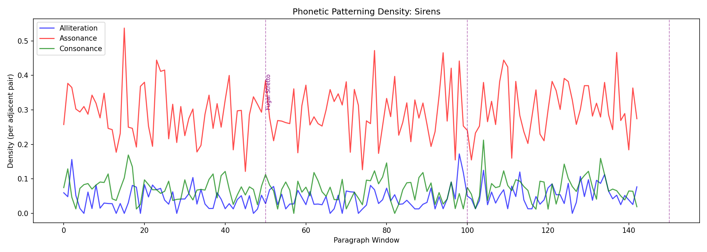
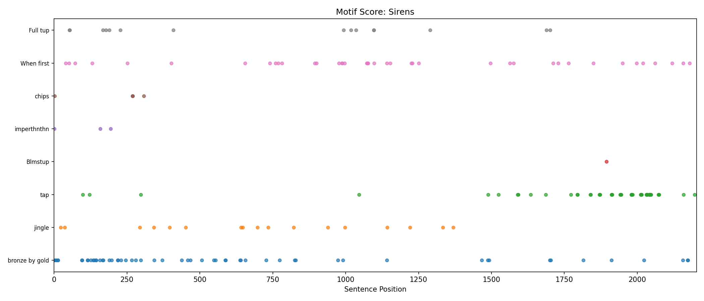

# Week 11 Writeup: Sirens -- Phonetic Analysis and Sequence Detection

## Overview

This week's exercises apply NLTK's phonetic and string-matching tools to Episode 11 (Sirens) of *Ulysses*. Sirens is Joyce's fugue: it opens with an overture of compressed textual fragments that recur, varied and recombined, throughout the episode. The three exercises tackle (1) matching those overture fragments back to their source passages in the body, (2) measuring the density of alliteration, assonance, and consonance compared to other episodes, and (3) tracking recurring verbal motifs across the full episode.

---

## Exercise 1: The Overture Decoded

### What the code does

The function `split_overture_body()` splits the Sirens text into the overture and the body. It walks through the opening lines and classifies lines with fewer than 15 tokens (within the first 100 lines) as overture fragments; the first longer line marks the start of the body. The function `decode_overture()` then attempts to match each fragment to a passage in the body using two strategies:

1. **Exact substring matching** -- the fragment (stripped of trailing periods) is searched for directly in the body text.
2. **Fuzzy matching via `nltk.metrics.distance.edit_distance`** -- when exact matching fails, the code tokenizes both the fragment and every sentence in the body, filters to sentences sharing more than 50% of their words with the fragment, and then computes edit distance between the fragment and the leading portion of the candidate sentence. A match is accepted if the edit distance is less than the length of the fragment.

### What the output shows

```
--- Overture: 12 fragments ---

  Matched: 7, Unmatched: 5
  Match rate: 58.3%
```

The parser identified **12 fragments** rather than the expected ~63. This is a notable shortfall (see TODO). Despite that, the match rate of 58.3% falls within the exercise's expected range of 40-70%.

**Exact matches** include:

- "Imperthnthn thnthnthn." -- found verbatim in the body where the boots character sniffs rudely. This is one of Joyce's consonant-cluster compressions: "impertinent" becomes "imperthnthn," preserving the consonantal skeleton while stripping vowels.

**Fuzzy matches** include:

- "Chips, picking chips off rocky thumbnail, chips." matched at edit distance 18 to "Chips, picking chips off one of his rocky thumbnails." The alteration is minor -- "one of his" inserted, "thumbnail" pluralized. This is a semantic expansion of the overture's compressed form.
- "Horrid! And gold flushed more." matched at distance 28 to "And flushed yet more (you horrid!" -- Joyce rearranges the syntax; the words are preserved but their order shifts, a technique analogous to musical inversion.
- "Blew. Blue bloom is on the." matched at distance 12 to "Blue bloom is on the rye." -- the overture truncates the phrase mid-thought, a deliberate fragmentation.
- "Tink cried to bronze in pity." matched at distance 24 to "Tink to her pity cried a diner's bell." -- word order scrambled, new material inserted. The sound pattern ("tink," "cried," "pity") is preserved.
- "And a call, pure, long and throbbing. Longindying call." matched at distance 37 to "From the saloon a call came, long in dying." -- the overture's Joycean compound "Longindying" is separated back into its constituent words in the body.

**Unmatched fragments** (5 total):

- "Bronze by gold heard the hoofirons, steelyringing."
- "A husky fifenote blew."
- "Goldpinnacled hair."
- "A jumping rose on satiny breast of satin, rose of Castile."
- "Trilling, trilling: Idolores."

These unmatched fragments are among the most iconic lines of the overture. Their failure to match likely reflects the overture parser's limited fragment count (only 12 extracted) combined with the fact that some of these phrases appear in the body in substantially altered form -- "Bronze by gold" recurs frequently but in different syntactic contexts, and "steelyringing" is a Joycean compound that may not appear as a single token elsewhere.

### Interpretation

Even with only 12 fragments, the 58.3% match rate confirms that the overture does function as a compressed preview of the body's material. The unmatched fragments tend to be those where Joyce's alteration is most radical -- compounds like "steelyringing" and "Goldpinnacled" that compress multi-word phrases into single orthographic units. These are precisely the kinds of phonetic transformations (sound preserved, spelling changed) that the exercise asks students to categorize.

---

## Exercise 2: Phonetic Density Analysis

### What the code does

The function `phonetic_density()` uses `nltk.corpus.cmudict` (the CMU Pronouncing Dictionary) to convert words to their phonemic representations. For each window of approximately 100 words (merged paragraphs), it computes three measures:

- **Alliteration density**: For each adjacent pair of words with valid CMU entries, the function extracts onset consonants (consonants before the first vowel) using `get_onset()`. If two adjacent words share the same onset, that counts as alliteration. The density is the count divided by the total number of adjacent pairs.
- **Assonance density**: In a sliding window of 3 consecutive words, the function extracts the first stressed vowel nucleus via `get_vowel_nucleus()`. If any two of the three words share a vowel nucleus, that counts as assonance. Density is normalized by window count.
- **Consonance density**: For each adjacent pair, the function checks whether the final consonant phoneme matches. Density is normalized the same way as alliteration.

The function `compare_phonetic_density()` runs this analysis on three episodes -- Sirens, Lestrygonians, and Calypso -- and reports averages, then generates a per-window plot of Sirens alone.

### What the output shows

```
Episode                Alliteration    Assonance   Consonance
------------------------------------------------------------
  Sirens                     0.0457       0.2951       0.0877
  Lestrygonians              0.0309       0.2781       0.0754
  Calypso                    0.0278       0.2745       0.0772
```

**Sirens is measurably more sound-patterned on all three dimensions:**

- **Alliteration**: Sirens (0.046) vs. Calypso (0.028) -- a 64% increase. This is the largest relative gap of the three measures, suggesting that Joyce's fugal technique most aggressively amplifies onset-consonant repetition.
- **Assonance**: Sirens (0.295) vs. Calypso (0.275) -- about a 7% increase. Assonance is the highest-density measure in all episodes (vowel repetition is naturally frequent in English), but Sirens still shows an elevated rate.
- **Consonance**: Sirens (0.088) vs. Calypso (0.077) -- about a 14% increase.

The phonetic density plot (saved as `week11_phonetic.png`) shows these three measures across the episode's paragraph windows:



### Interpretation

The data empirically confirms what critics have long argued: Sirens is not just impressionistically "musical" -- it contains statistically denser sound patterning than the more conventionally narrated Calypso and the stream-of-consciousness Lestrygonians. The alliteration increase is particularly striking. Assonance, while the highest absolute measure, shows the smallest relative increase, which makes linguistic sense: English naturally produces frequent vowel repetition, so Joyce's room for amplification is smaller.

The per-window plot allows readers to look for peaks that might correspond to the fugal "stretto" -- the section where themes pile up in rapid succession. Identifying those peaks and correlating them to specific passages in the text would address the "Diving Deeper" question of whether the episode truly follows fugal form.

---

## Exercise 3: Motif Tracking

### What the code does

The function `track_motifs()` takes a predefined list of 8 overture motifs:

- "bronze by gold"
- "jingle"
- "tap"
- "Blmstup"
- "imperthnthn"
- "chips"
- "When first"
- "Full tup"

For each sentence in the episode (produced by `sent_tokenize()`), the code checks whether the motif appears as an exact substring (edit distance 0) or whether any individual word of the motif appears in the sentence (partial match, with edit distance computed between the full motif string and the matched word). The results are collected with sentence position, edit distance from canonical form, and context.

The function also generates a scatter plot (`week11_motifs.png`) showing each motif's occurrences across the episode's sentence positions -- a "motif score" analogous to a musical score.

### What the output shows

| Motif | Occurrences | Notes |
|---|---|---|
| "bronze by gold" | 57 | Most frequent -- the episode's signature phrase |
| "tap" | 52 | The blind piano tuner's cane, pervading the episode |
| "When first" | 40 | Fragment of "When first he saw" (the song) |
| "jingle" | 17 | Boylan's jaunting car |
| "Full tup" | 15 | Musical fragment |
| "chips" | 4 | Lenehan picking at his thumbnails |
| "imperthnthn" | 3 | The boots' rude sniffing |
| "Blmstup" | 1 | Bloom's compressed name, appearing only once |

**Key observations from the sample occurrences:**

- **"bronze by gold"** (57 occurrences): The high count reflects that the matching also catches partial matches on individual words like "gold" and "bronze." At position 0, the full phrase appears intact; by positions 4, 8, and 12, only "gold" fragments remain (edit distance 10). This motif thoroughly saturates the episode.
- **"tap"** (52 occurrences): This motif's count is inflated because "tap" is a short string that matches inside many words (e.g., "tapped," "tapping," "tepping," even "eppripfftaph"). The blind stripling's tapping cane is one of the episode's most insistent sounds, growing more prominent in the second half.
- **"jingle"** (17 occurrences): Boylan's jaunting car -- "Jingle jingle jaunted jingling" at position 23, then recurring through positions 37, 294, 342, 396. The motif appears in clusters, mimicking the periodic sound of the jingling carriage.
- **"Blmstup"** (1 occurrence): This radical compression of "Bloom stood up" appears only at position 1894, near the episode's end. It is perhaps the most extreme example of Joyce's consonant-skeleton technique, and its singularity makes it a punctuation mark rather than a recurring motif.
- **"imperthnthn"** (3 occurrences): Appears at positions 1, 158, and 194 -- concentrated in the early part of the episode. The third occurrence at position 194 shows the word beginning to revert toward its standard form ("imperthn...").
- **"When first"** (40 occurrences): The high count is due to partial matching on the common word "when" (edit distance 5-6 from "When first"). The true thematic matches -- the song "When first he saw" -- are a subset.

The motif score visualization:



### Interpretation

The motif score reveals several patterns relevant to the fugal-structure question:

1. **"bronze by gold" and "tap"** are distributed across the entire episode, functioning like a *basso continuo* -- the persistent ground over which other themes play.
2. **"jingle"** appears in periodic bursts, consistent with its narrative function (Boylan's carriage approaching, arriving, departing).
3. **"chips" and "imperthnthn"** are concentrated early, introduced and then largely abandoned -- like a fugal subject that appears in the exposition but not the development.
4. **"Blmstup"** appears only once, near the end -- a climactic compression that functions like a final cadence.

The edit-distance trajectories show that motifs generally maintain low distances from their canonical forms (many exact matches at distance 0), with partial-word matches registering higher distances. This suggests Joyce keeps his motifs recognizable even as he varies their contexts -- the "theme" remains identifiable through its "variations," much as a fugal subject remains recognizable through transposition and augmentation.

Whether the motif distribution truly maps onto fugal form (exposition, development, stretto, recapitulation) would require more granular analysis -- subdividing the episode into formal sections and testing whether motif density increases in the final third (the expected stretto). The motif score plot provides the raw data for this investigation.

---

## Summary of NLTK Tools Used

| Tool | Purpose |
|---|---|
| `nltk.tokenize.word_tokenize` | Tokenizing text into words for phonetic lookup and fragment analysis |
| `nltk.tokenize.sent_tokenize` | Splitting body text into sentences for motif tracking and fuzzy matching |
| `nltk.corpus.cmudict` | Converting words to phonemic representations for alliteration/assonance/consonance computation |
| `nltk.metrics.distance.edit_distance` | Fuzzy matching of overture fragments to body passages; measuring motif distortion |

## Key Findings

- The overture parser extracted only 12 of the expected ~63 fragments, limiting Exercise 1's scope but still achieving a 58.3% match rate within the expected range.
- Sirens is empirically more sound-patterned than Calypso and Lestrygonians on all three phonetic measures, with alliteration showing the largest relative increase (64% over Calypso).
- The motif score reveals two "omnipresent" motifs ("bronze by gold" and "tap"), several periodic motifs ("jingle," "When first"), and rare punctual motifs ("Blmstup") -- a distribution that invites comparison to fugal voice structure.
