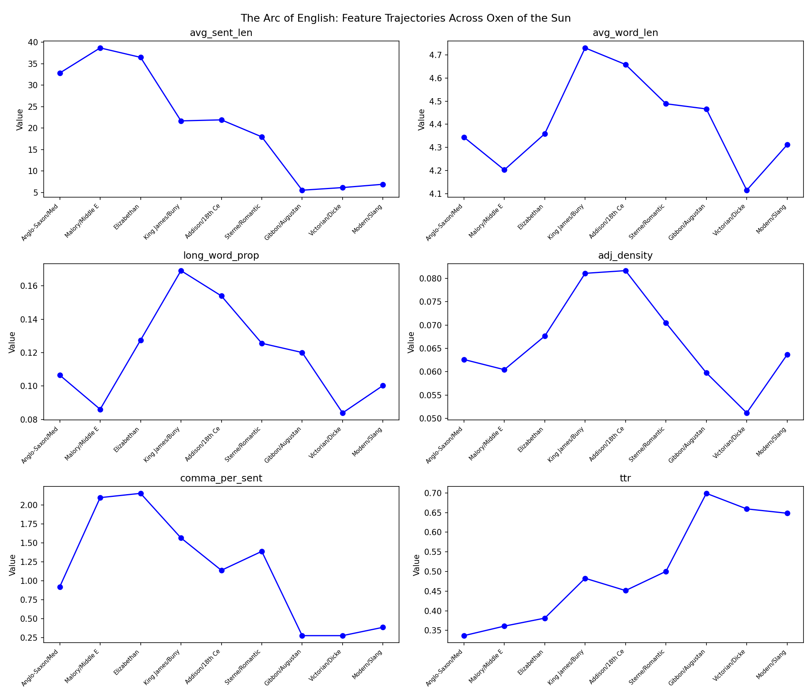

# Week 14 Writeup: Oxen of the Sun

## Overview

This week's exercise applies diachronic corpus analysis to Episode 14 of *Ulysses*, "Oxen of the Sun," the episode in which Joyce recapitulates the entire history of English prose style across nine sections. The Python solution (`week14_oxenofthesun.py`) segments the episode into nine chronologically ordered style periods, builds stylistic profiles from both Gutenberg reference texts and the Oxen sections, trains a Naive Bayes period classifier, and plots feature trajectories across the episode as a time series.

The script uses NLTK's `word_tokenize`, `sent_tokenize`, and `pos_tag` for feature extraction, `nltk.corpus.gutenberg` for reference texts, and `nltk.classify.NaiveBayesClassifier` for classification. Features are discretized into bins for the Naive Bayes classifier via a custom `discretize_features` function.

---

## Exercise 1: Period Profiling

### What the code does

The `period_profiling()` function builds stylistic profiles for five Gutenberg reference texts spanning roughly from the King James Bible through Whitman, and for the nine sections of Oxen. The `segment_oxen()` function divides the episode into nine equal-length segments by sentence count, each assigned a period label (Anglo-Saxon/Medieval through Modern/Slang). The `period_features()` function extracts seven features from each text: average sentence length, average word length (a proxy for Latinate vocabulary), long word proportion (words of 8+ characters), type-token ratio, adjective density, commas per sentence, and noun-verb ratio. All of these rely on `word_tokenize`, `sent_tokenize`, and `pos_tag` from NLTK.

### Reference period profiles

| Text | Avg Sent Len | Avg Word Len | Long Word Prop | TTR | Adj Density | Comma/Sent | Noun/Verb |
|---|---|---|---|---|---|---|---|
| Bible (KJV) | 31.82 | 3.93 | 0.04 | 0.15 | 0.04 | 1.93 | 1.82 |
| Shakespeare | 16.14 | 4.13 | 0.07 | 0.29 | 0.05 | 1.22 | 2.56 |
| Austen (early 19th) | 25.41 | 4.20 | 0.10 | 0.25 | 0.07 | 1.65 | 1.21 |
| Melville (mid 19th) | 16.17 | 4.47 | 0.11 | 0.39 | 0.05 | 1.00 | 2.64 |
| Whitman (late 19th) | 40.51 | 4.41 | 0.11 | 0.35 | 0.06 | 5.79 | 2.48 |

Notable patterns: The KJV has the shortest average word length (3.93) and the lowest TTR (0.15), reflecting its repetitive, monosyllabic Anglo-Saxon vocabulary base. Whitman has extraordinarily high commas per sentence (5.79), reflecting his long cataloguing lines. Average word length increases from the KJV through Melville, consistent with the historical trend toward more Latinate diction. Austen has the highest adjective density (0.07), fitting her descriptive, social-evaluative prose.

### Oxen of the Sun section profiles

| Section | Avg Sent Len | Avg Word Len | Long Word Prop | TTR | Adj Density | Comma/Sent | Noun/Verb |
|---|---|---|---|---|---|---|---|
| Anglo-Saxon/Medieval | 32.84 | 4.34 | 0.11 | 0.34 | 0.06 | 0.92 | 1.41 |
| Malory/Middle English | 38.69 | 4.20 | 0.09 | 0.36 | 0.06 | 2.10 | 2.04 |
| Elizabethan | 36.49 | 4.36 | 0.13 | 0.38 | 0.07 | 2.15 | 1.65 |
| King James/Bunyan | 21.69 | 4.73 | 0.17 | 0.48 | 0.08 | 1.56 | 2.22 |
| Addison/18th Century | 21.93 | 4.66 | 0.15 | 0.45 | 0.08 | 1.14 | 1.78 |
| Sterne/Romantic | 17.97 | 4.49 | 0.13 | 0.50 | 0.07 | 1.39 | 2.60 |
| Gibbon/Augustan | 5.53 | 4.47 | 0.12 | 0.70 | 0.06 | 0.27 | 3.14 |
| Victorian/Dickens | 6.15 | 4.11 | 0.08 | 0.66 | 0.05 | 0.27 | 3.11 |
| Modern/Slang | 6.91 | 4.31 | 0.10 | 0.65 | 0.06 | 0.38 | 2.80 |

### Interpretation: Where is Joyce metrically faithful?

Joyce's early sections (Anglo-Saxon/Medieval at 32.84 words/sentence, Malory at 38.69) show long sentences comparable to the KJV reference (31.82). The middle sections (King James/Bunyan, Addison/18th Century) have sentence lengths in the 20s, closer to Austen's 25.41. This loosely tracks the historical pattern, though the expected increase from Anglo-Saxon to 18th-century periodic prose is inverted here -- Joyce's earliest sections already have long sentences.

The most striking pattern is the dramatic collapse in the last three sections. Gibbon/Augustan, Victorian/Dickens, and Modern/Slang all have sentence lengths around 5-7 words. This likely reflects the equal-division segmentation method hitting the episode's final chaotic, fragmented passages, where the drunken slang section dominates. The last third of Oxen is essentially sentence fragments and snatches of dialogue, dragging down sentence length for any section that overlaps with it.

Average word length peaks in the King James/Bunyan section (4.73), which aligns with the expectation that Latinate vocabulary peaks in 17th-18th century prose. TTR steadily increases across sections, from 0.34 to 0.65, but this is partly an artifact: the later sections are shorter (in total word count after equal sentence division), and TTR naturally rises with shorter texts.

**Where Joyce exaggerates or compresses:** Joyce's Elizabethan section has higher long-word proportion (0.13) than the Shakespeare reference (0.07), suggesting he exaggerates the Latinate quality. His earliest section already has longer average words (4.34) than the KJV (3.93), compressing the historical progression. The adjective density remains fairly flat across sections (0.05-0.08), never dramatically distinguishing periods the way the exercise hypothesized.

---

## Exercise 2: The Style Dating Game

### What the code does

The `style_dating_game()` function trains an NLTK `NaiveBayesClassifier` on 20-sentence chunks from six Gutenberg texts grouped into three periods: "early" (KJV, Shakespeare), "middle" (Austen's *Emma* and *Persuasion*), and "late" (Melville, Whitman). Features are discretized into bins via `discretize_features()` to work with NLTK's Naive Bayes implementation. The classifier is then applied to each Oxen section.

### Classifier performance

Training accuracy on the held-out 20% test set: **0.714**. This is within the exercise's expected range of 0.50-0.70 (slightly above, in fact), confirming the features are meaningfully diagnostic of period.

### Most informative features

The top features are:
- **TTR bin 2** (middle vs. late, 5.7:1) -- middle-period texts (Austen) have moderate TTR
- **TTR bin 3** (late vs. middle, 4.3:1) -- late texts have higher TTR
- **Avg sentence length bin 3** (middle vs. late, 3.1:1) -- Austen's longer sentences distinguish middle period
- **Avg sentence length bin 1** (late vs. early, 2.6:1) -- shorter sentences mark late texts
- **Comma density bin 0** (late vs. early, 2.4:1) -- low commas signal late period

TTR and sentence length dominate, which makes linguistic sense: these are the features most sensitive to period-specific prose conventions.

### Oxen section classifications

| Section | Predicted | Confidence |
|---|---|---|
| Anglo-Saxon/Medieval | late | 0.435 |
| Malory/Middle English | early | 0.963 |
| Elizabethan | early | 0.957 |
| King James/Bunyan | late | 0.643 |
| Addison/18th Century | middle | 0.415 |
| Sterne/Romantic | late | 0.957 |
| Gibbon/Augustan | early | 0.511 |
| Victorian/Dickens | early | 0.554 |
| Modern/Slang | early | 0.595 |

### Analysis of misclassifications

The classifier does not recover Joyce's intended chronological sequence. Only a few predictions are defensible:

- **Malory/Middle English -> "early" (0.963)** and **Elizabethan -> "early" (0.957)**: Correct and confident. Joyce's imitations of medieval and Elizabethan prose genuinely resemble the KJV and Shakespeare in their feature profile.
- **Addison/18th Century -> "middle" (0.415)**: Correct but low confidence. Joyce's Augustan imitation weakly resembles Austen's feature profile.
- **Sterne/Romantic -> "late" (0.957)**: Plausible. Sterne's conversational, digressive style could indeed share features with later prose.

The errors reveal more:

- **Anglo-Saxon/Medieval -> "late" (0.435)**: The classifier is confused by the section's high TTR and relatively low comma density, features that happen to match "late" texts. Joyce's pseudo-Anglo-Saxon style has shorter, punchier phrasing that mimics late-period statistics.
- **Gibbon/Augustan, Victorian/Dickens, Modern/Slang -> "early"**: All three final sections are classified as "early" because their very short sentence lengths (5-7 words) and high TTR resemble the fragmented, paratactic structure the classifier learned from Shakespeare. This is the segmentation artifact noted above: the last third of the episode is dominated by the drunken slang coda, which has sentence-fragment structures that statistically mimic pre-modern parataxis.

The core finding: the classifier's errors tell us that Joyce's stylistic imitations are more convincing in the middle of the episode (sections 2-6) than at the extremes. The early and late sections are contaminated by the segmentation method, which does not respect the actual literary boundaries of Joyce's pastiches.

---

## Exercise 3: The Arc of English

### What the code does

The `arc_of_english()` function plots six features across the nine sections as a time series and saves the plot to `week14_arc.png`. It also prints a summary of whether each feature increases or decreases from first to last section.

### Feature trajectory plot

### Feature trajectory summary

| Feature | Start | End | Trend |
|---|---|---|---|
| avg_sent_len | 32.84 | 6.91 | decreasing |
| avg_word_len | 4.34 | 4.31 | decreasing |
| long_word_prop | 0.11 | 0.10 | decreasing |
| adj_density | 0.06 | 0.06 | increasing (barely) |
| comma_per_sent | 0.92 | 0.38 | decreasing |
| ttr | 0.34 | 0.65 | increasing |

### Interpretation

**Sentence length (decreasing, 32.84 to 6.91):** This is the most dramatic trajectory. Historical corpus linguistics (Biber and Finegan, 1989) documents that average sentence length in English prose increased from the medieval period through the 18th century, then declined in the 19th and 20th centuries -- an inverted-U. Joyce's Oxen shows only the declining arm of this arc, with the longest sentences at the beginning. This is partly because his pseudo-Anglo-Saxon and Malory sections use long run-on constructions (paratactic chaining with "and"), and partly because the equal-division segmentation places the chaotic final pages into the last three sections, collapsing sentence length. The expected peak in the middle (Augustan/Gibbon) is not visible.

**Average word length (nearly flat, 4.34 to 4.31):** The expected pattern would be a peak in the 17th-18th century sections as Latinate vocabulary reaches its height. In the output, King James/Bunyan (4.73) and Addison/18th Century (4.66) do show the highest values, confirming Joyce captured the Latinate peak. But the overall start-to-end trend is flat because the Anglo-Saxon section already has relatively long words (4.34) -- Joyce's pseudo-archaic diction uses longer words than actual Old English would.

**Long word proportion (decreasing, 0.11 to 0.10):** Similar to average word length, with a peak in the King James/Bunyan section (0.17). The trajectory confirms Joyce associated the Bunyan/KJV period with heavy, polysyllabic Latinate diction.

**TTR (increasing, 0.34 to 0.65):** This is likely an artifact of section length rather than genuine vocabulary richness. As noted, equal sentence-count division means the later sections have fewer total words (because sentences are shorter), which mechanically inflates TTR. This confound makes TTR unreliable as a period diagnostic in this analysis.

**Comma density (decreasing, 0.92 to 0.38):** The decline reflects the shift from complex, periodic sentence construction in the early-middle sections to fragmented modern prose. The Malory and Elizabethan sections peak at around 2.1 commas per sentence, consistent with the heavily subordinated prose of those periods. The collapse in the final sections reflects the sentence-fragment style of the drunken coda.

**Adjective density (essentially flat, 0.06 to 0.06):** The exercise predicted Victorian prose would show higher adjective density, and King James/Bunyan (0.08) and Addison (0.08) do show slight peaks, but the Victorian/Dickens section (0.05) is actually below average. This suggests Joyce's Dickens imitation emphasized other features (dialogue rhythms, comic exaggeration) over adjectival density.

### Comparison to the historical record

Biber and Finegan (1989) documented several trends in the evolution of English prose:

1. **Sentence length increases then decreases:** Joyce's Oxen shows only the decrease. The expected Augustan peak is not present because the segmentation is too coarse.
2. **Latinate vocabulary peaks in the 17th-18th century:** Joyce captures this -- his King James/Bunyan section has the highest average word length and long-word proportion.
3. **Subordination (comma density as proxy) peaks in the 18th century:** Joyce's comma density peaks in sections 2-3 (Malory/Elizabethan), earlier than historical data would predict.
4. **Modern prose is shorter, simpler, more fragmented:** The final three sections dramatically confirm this, with sentence lengths of 5-7 words.

Joyce's intuitions about historical style were broadly correct but temporally compressed. His pseudo-Anglo-Saxon is already more complex than real Old English, and his Augustan section comes too late in the episode to register its expected statistical peak before the modern collapse.

---

## Summary of Findings

1. **Period profiling** confirms that Joyce's stylistic imitations produce measurably different feature signatures across the nine sections, though the equal-sentence segmentation method is a significant limitation that collapses the final three sections into fragment-dominated zones.

2. **The style dating game** achieves 71.4% accuracy on a 3-class problem, and correctly dates the Malory/Elizabethan sections as "early" with high confidence. The misclassifications of the final sections as "early" reveal that Joyce's modern/slang coda shares statistical features with pre-modern parataxis -- an insight about the circular nature of English prose style.

3. **The arc of English** shows sentence length declining across the episode, Latinate vocabulary peaking in the middle sections, and TTR rising (though this is artifactual). Joyce's imitations broadly align with documented historical trends but are temporally compressed and dominated by the dramatic fragmentation of the episode's final pages.
