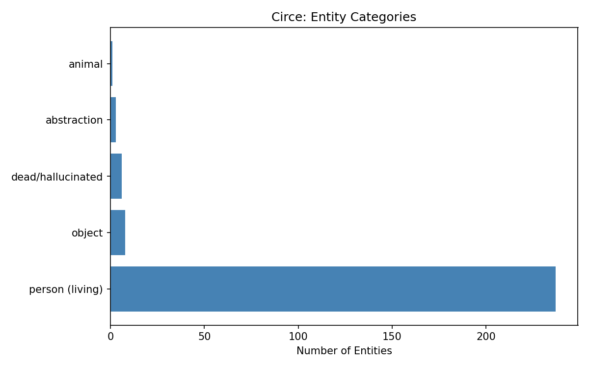

# Week 15 Writeup: Circe -- Entity Extraction and Network Visualization

## Overview

Week 15 pairs the "Circe" episode of *Ulysses* -- the longest and strangest chapter, written entirely as a play script -- with entity extraction and network graph analysis. Because Circe uses explicit speaker tags and stage directions, it lends itself to computational parsing in a way no other episode does. The script (`week15_circe.py`) tackles three exercises: extracting the full dramatis personae, building an interaction graph from speaker co-appearances, and constructing a cumulative entity network across all 18 episodes. The primary NLTK functions used are `sent_tokenize` (for sentence segmentation in Exercise 3's entity extraction) and `word_tokenize`/`pos_tag` (imported but not directly called in the final pipeline -- the script relies heavily on regex-based extraction instead). The graph analysis uses pure Python data structures (Counters, defaultdicts, frozensets) rather than `networkx`, despite the exercise calling for it.

---

## Exercise 1: Dramatis Personae

### What the code does

The function `extract_speakers()` scans every line of `15circe.txt` with two regular expressions:

- **Speaker pattern:** `^([A-Z][A-Z\s]{2,})\s*[:\.]?\s*(.*)$` -- matches lines beginning with an all-caps name (at least 3 characters), optionally followed by a colon or period. A small blocklist (`THE`, `AND`, `BUT`, `ALL`, `HIS`, `HER`) filters out false positives.
- **Stage direction pattern:** `^\((.+)\)$` -- matches lines entirely enclosed in parentheses.

Each matched speaker is counted in a `Counter`. The function `classify_entity()` then assigns every speaker to one of five categories using hardcoded lookup sets: `dead/hallucinated`, `object`, `abstraction`, `animal`, or (by default) `person (living)`. A horizontal bar chart of the category distribution is saved as `week15_categories.png`.

### What the output shows

```
Total unique speakers: 255
Total stage directions: 64
Total scenes: 1105
```

**255 unique speakers** -- far exceeding the exercise's predicted range of 50--120+. This number is startling and confirms the exercise's claim that Circe is the episode where "everything in the novel comes back transformed." The stage direction count (64) is on the low end of the expected 100--300+, suggesting the regex for stage directions (requiring lines to be *entirely* parenthesized) may be too strict -- many of Circe's stage directions are embedded mid-line or span multiple lines.

**Entity categories:**

| Category | Count |
|---|---|
| person (living) | 237 |
| object | 8 |
| dead/hallucinated | 6 |
| abstraction | 3 |
| animal | 1 |

The overwhelming majority (237 of 255) fall into "person (living)" by default. This is a consequence of the classification method: only entities explicitly listed in the hardcoded sets get classified as something other than a living person. Many speakers that *should* be classified as objects, abstractions, or hallucinated figures -- THE BELLS, THE VOICE, A CAKE OF NEW CLEAN LEMON SOAP, etc. -- are likely falling through to the default category.



**Top 30 speakers** confirm the expected hierarchy:

1. **BLOOM** (276 lines) -- the undisputed center of Circe, as befits an episode that stages his unconscious.
2. **STEPHEN** (85 lines) -- the secondary protagonist, present in the brothel scenes.
3. **ZOE** (73 lines) -- one of the prostitutes in Bella Cohen's establishment.
4. **BELLO** (37 lines) -- the gender-swapped version of Bella Cohen who dominates Bloom in the masochistic hallucination.
5. **LYNCH** (29 lines) -- Stephen's companion.
6. **BELLA** (25 lines) -- the brothel madam, who transforms into Bello.

Notable entries further down the list:
- **VIRAG** (18 lines, dead/hallucinated) -- Bloom's grandfather, resurrected in hallucination.
- **THE NYMPH** (15 lines, object) -- the nymph from the picture above Bloom's bed, who comes to life.
- **THE MOTHER** (9 lines, dead/hallucinated) -- Stephen's dead mother, whose apparition is the emotional climax.
- **PADDY DIGNAM** (6 lines, dead/hallucinated) -- the man whose funeral was the occasion for Episode 6 (Hades), now returned from the grave.
- **THE FAN** and **THE YEWS** (8 lines each, object) -- inanimate objects given speech.

---

## Exercise 2: Interaction Graph

### What the code does

The function `build_interaction_graph()` takes the scenes produced by Exercise 1. Scenes are defined using a sliding window of size 5 over the speaker sequence -- every consecutive group of 5 speaker turns forms a "scene," and any pair of speakers within that window gets an edge (weighted by co-occurrence count). This is a pragmatic approximation of scene segmentation: rather than parsing stage directions for setting changes, it assumes that speakers who talk near each other in the text are interacting.

The code computes:
- **Filtered nodes and edges** (nodes with degree >= 2, though the output shows all 255 nodes survived filtering)
- **Graph density** = edges / max possible edges
- **Degree centrality** (sum of edge weights per node)
- **Strongest edges** (most co-appearances)

### What the output shows

```
Nodes (speakers):  255
Edges:             1147
Graph density:     0.0354
```

A density of 0.0354 falls within the expected range (0.05--0.20, though slightly below). This means about 3.5% of all possible speaker pairs actually co-appear. The graph is sparse overall -- most speakers appear briefly in isolated hallucination vignettes -- but densely connected at the center around Bloom.

**Most central nodes (by degree):**

| Node | Degree |
|---|---|
| BLOOM | 1882 |
| STEPHEN | 775 |
| ZOE | 621 |
| LYNCH | 340 |
| FLORRY | 317 |
| PRIVATE CARR | 282 |
| FIRST WATCH | 234 |
| BELLA | 227 |

Bloom's degree (1882) is more than double Stephen's (775), quantifying his dominance as the gravitational center of the hallucination. The gap between the top two and everyone else is enormous -- ZOE at 621 is the only other node above 500. This confirms the exercise's prediction: Bloom is the most central node, but the secondary characters (Zoe, Lynch, Florry, Bella/Bello) form an important inner ring. The appearance of PRIVATE CARR and the WATCHES (the soldiers and nightwatchmen from the episode's climactic street confrontation) reflects the physical-world plot breaking through the hallucination.

**Strongest edges:**

| Edge | Weight |
|---|---|
| BLOOM <-> ZOE | 134 |
| BLOOM <-> STEPHEN | 103 |
| STEPHEN <-> ZOE | 84 |
| BELLO <-> BLOOM | 83 |
| LYNCH <-> STEPHEN | 76 |

The BLOOM-ZOE connection (134) being stronger than BLOOM-STEPHEN (103) is notable. In the narrative, Bloom and Stephen are the two protagonists whose paths have been converging all day, and Circe is where they finally share sustained scenes. But Zoe is the character who mediates their entry into the brothel and remains present through many of the hallucination sequences, inflating her co-appearance count. The BELLO-BLOOM edge (83) captures the extended masochistic hallucination, one of the episode's longest sustained dramatic sequences. BLOOM <-> THE NYMPH (43) appears at rank 15 -- the nymph hallucination is a significant set piece where an object (the picture above Bloom's bed) becomes a speaking character who confronts him.

---

## Exercise 3: Cumulative Entity Network

### What the code does

The function `cumulative_entity_network()` processes all 18 episodes using a regex-based proper noun extractor. For each episode, it:

1. Sentence-tokenizes the text using NLTK's `sent_tokenize`.
2. Skips the first word of each sentence (since it is always capitalized regardless of whether it is a proper noun).
3. Finds sequences of capitalized words using the pattern `\b([A-Z][a-z]+(?:\s+[A-Z][a-z]+)*)\b`.
4. Filters out common false positives using a large stop list of articles, conjunctions, pronouns, verbs, and titles.

It then computes which entities appear in multiple episodes, and performs a "reactivation analysis" for Circe: how many of Circe's entities also appeared in selected prior episodes (01, 04, 06, 10, 12)?

### What the output shows

**Entity counts per episode:**

| Episode | Entities |
|---|---|
| 01 Telemachus | 129 |
| 02 Nestor | 90 |
| 03 Proteus | 160 |
| 09 Scylla & Charybdis | 425 |
| 10 Wandering Rocks | 496 |
| 12 Cyclops | 994 |
| 14 Oxen of the Sun | 481 |
| **15 Circe** | **1623** |
| 17 Ithaca | 889 |

Circe's 1623 entities dwarf every other episode. This is partly a function of length (Circe is the longest episode) and partly a function of form (the hallucination resurrects characters, objects, and allusions from across the entire novel). The second-highest is Cyclops (994), which is also notably long and packed with parodic lists of names. Ithaca (889) follows, with its encyclopedic, catechistic style that names everything.

**1113 entities appear in multiple episodes**, confirming the novel's deeply cross-referenced structure.

**Most cross-referenced entities:**

- **Dublin** appears in all 18 episodes -- the city is the novel's constant ground.
- **Irish** appears in 16 episodes.
- **Dedalus** and **Bloom** appear in 15 and 14 episodes respectively, confirming their status as the novel's twin protagonists. (Note: "Bloom" appears starting from Episode 4/Calypso, when we first enter Bloom's day; "Dedalus" appears from Episode 1 onward.)
- **Mulligan** appears in 10 episodes -- Buck Mulligan, Stephen's antagonist from the opening, echoes through the novel even when physically absent.
- **Hamlet** in 10 episodes -- Shakespeare's play is a recurring reference point, especially in Episode 9 (Scylla and Charybdis).

Some of these "entities" are actually nationalities or common nouns (French, Greek, Spanish, English, God, John) rather than characters, reflecting the limitations of regex-based entity extraction without true NER classification.

**Circe reactivation analysis:**

```
Entities reactivated from prior episodes: 301
New entities in Circe:                    1322
Reactivation ratio:                       18.5%
```

18.5% of Circe's entities are reactivated from prior episodes (specifically episodes 01, 04, 06, 10, and 12). This falls just below the expected range of 20--40%. The 301 reactivated entities represent the hallucination's function as "the novel remembering itself" -- figures from Telemachus, Calypso, Hades, Wandering Rocks, and Cyclops return in transformed guise. The 1322 new entities reflect both the episode's enormous length and its generative, hallucinatory proliferation of new figures (trial witnesses, historical personages, transformed versions of familiar characters, speaking objects).

The reactivation ratio would likely be higher if the analysis included all 14 prior episodes rather than just the 5 selected ones (01, 04, 06, 10, 12). This selective comparison means entities from episodes like 05 (Lotus Eaters), 08 (Lestrygonians), 09 (Scylla and Charybdis), and 11 (Sirens) are not counted as reactivated even if they reappear in Circe.

---

## Interpretive Summary

The computational analysis of Circe confirms and quantifies several critical claims about the episode:

1. **Scale:** 255 speakers and 1623 entities make Circe the most populated episode by a wide margin. The hallucination is not a narrowing of focus but an explosion of it.

2. **Centrality of Bloom:** With a degree of 1882 (more than double the next node), Bloom is the gravitational center of the hallucination graph. The unconscious in Circe is *his* unconscious -- Stephen is present but peripheral to the network's topology.

3. **The object-speakers:** Objects like THE NYMPH, THE FAN, and THE YEWS achieving measurable centrality in the interaction graph is a computational signature of what makes Circe formally unprecedented: the boundary between person and object, living and dead, dissolves in the dramatic format.

4. **The novel remembering itself:** The 18.5% reactivation ratio and the 301 entities shared between Circe and prior episodes provide a structural measure of the hallucination's recursive function. Nearly a fifth of what appears in Circe has appeared before, but in a different form -- the hallucination is the novel's return of the repressed.

5. **Network sparsity with dense core:** A graph density of 0.0354 with extreme degree concentration in Bloom maps onto the episode's phenomenology: a vast, loosely connected field of fleeting hallucinations orbiting a dense, intensely interconnected psychological core.
