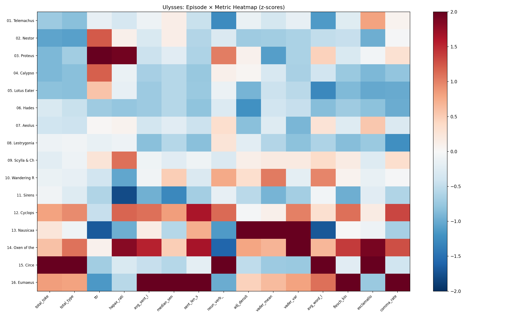
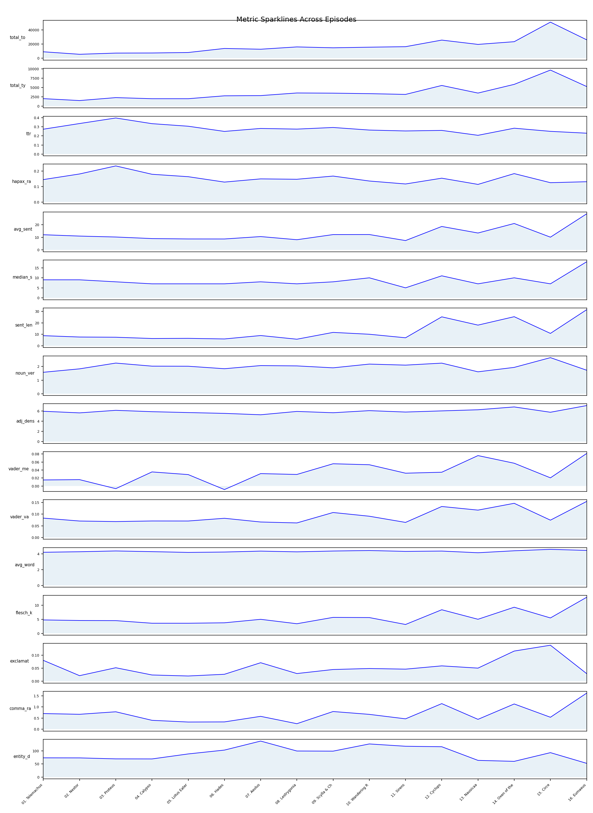
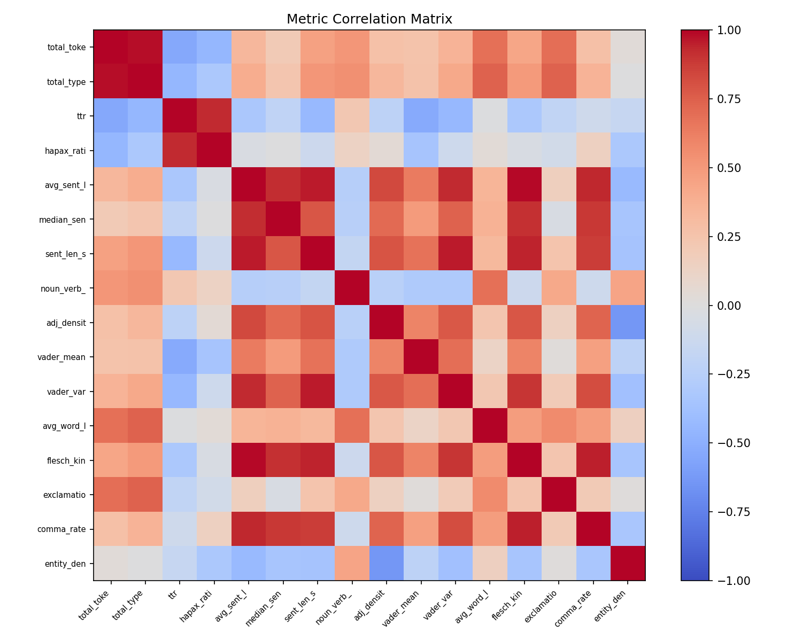

# Week 16 Writeup: Eumaeus — Corpus-Wide Metrics and Data Visualization

## Overview

Week 16 takes stock of the entire analytical journey so far. After fifteen weeks of episode-by-episode NLP analysis, the task is to compile every metric into a single master table, visualize the novel's computational anatomy through a multi-panel dashboard, and conduct an honest error audit of prior results. The pairing with Eumaeus is fitting: just as Bloom delivers a tired, imprecise summary of the day's events to Stephen in the cabman's shelter, the student assembles a tired, imprecise (but revealing) summary of everything the computer has measured.

The script (`week16_eumaeus.py`) loads all sixteen episode text files, computes fifteen metrics per episode using NLTK and NumPy, prints the master table with Eumaeus rankings, generates three dashboard visualizations with matplotlib, and catalogs seven known errors from prior weeks.

---

## Exercise 1: The Master Table

### What the Code Does

The function `compute_all_metrics()` processes each episode's raw text through a pipeline of NLTK tools:

- **Tokenization**: `word_tokenize()` produces the raw token list; alphabetic tokens are filtered and lowercased for vocabulary metrics.
- **Sentence segmentation**: `sent_tokenize()` splits the text into sentences, and each sentence is re-tokenized to compute per-sentence word counts.
- **Frequency distribution**: `FreqDist` from `nltk.probability` counts word frequencies; hapax legomena (words appearing exactly once) are tallied from this distribution.
- **POS tagging**: `pos_tag()` is applied to the first 5,000 tokens (a performance-motivated sample), and tag counts are aggregated by prefix: `NN*` for nouns, `VB*` for verbs, `JJ*` for adjectives.
- **Sentiment analysis**: NLTK's `SentimentIntensityAnalyzer` (VADER) scores the first 500 sentences, yielding a mean compound score and its variance.
- **Readability**: The Flesch-Kincaid grade level is approximated using the CMU Pronouncing Dictionary (`nltk.corpus.cmudict`) for syllable counts, with a fallback heuristic (`len(word) // 3`) for words not in CMU.
- **Punctuation rates**: Exclamation marks and commas are counted per sentence.

These fifteen metrics are assembled into a dictionary per episode, and the `build_master_table()` function iterates over all sixteen episodes, printing the results in two halves (eight columns, then seven columns).

### The Master Table Output

The first half of the table covers structural and vocabulary metrics:

| Metric | What It Measures |
|---|---|
| `total_tokens` | Raw word count (including punctuation tokens) |
| `total_types` | Count of unique lowercase alphabetic words |
| `ttr` | Type-token ratio: vocabulary richness |
| `hapax_ratio` | Proportion of types that appear only once |
| `avg_sent_len` | Mean number of tokens per sentence |
| `median_sent_len` | Median sentence length |
| `sent_len_std` | Standard deviation of sentence lengths |
| `noun_verb_ratio` | Ratio of noun tags to verb tags |

The second half covers style and sentiment:

| Metric | What It Measures |
|---|---|
| `adj_density` | Adjectives per 100 tagged tokens |
| `vader_mean` | Mean VADER compound sentiment |
| `vader_var` | Variance of VADER compound scores |
| `avg_word_len` | Mean character length of alphabetic words |
| `flesch_kincaid` | Flesch-Kincaid grade level (readability) |
| `exclamation_rate` | Exclamation marks per sentence |
| `comma_rate` | Commas per sentence |

### Key Patterns in the Data

**Episode length varies dramatically.** Circe (episode 15) towers over everything at 50,979 tokens — nearly double the next-largest episodes. Eumaeus (26,034), Cyclops (25,599), and Oxen of the Sun (23,343) form a middle cluster. The early Stephen episodes (Nestor at 5,549, Proteus at 7,237) are comparatively compact.

**Type-token ratio (TTR) declines with episode length**, as expected — longer texts naturally reuse more vocabulary. But Eumaeus (0.229) and Nausicaa (0.206) stand out as having especially low TTR even for their length. Nausicaa's low TTR reflects Gerty MacDowell's repetitive, cliche-laden interior monologue; Eumaeus's reflects the narrator's exhausted recycling of the same tired phrases. Proteus (0.396) has the highest TTR, matching its dense, intellectually restless prose.

**Sentence length is where Eumaeus dominates.** Its average sentence length of 28.5 words is far above any other episode. Oxen of the Sun (20.9) and Cyclops (18.5) are distant runners-up. The median of 18 words and standard deviation of 31.4 confirm that Eumaeus sentences are not just long on average — they are long and wildly variable. Some sentences ramble for dozens of words; others are terse fragments. This matches the episode's style: a narrator who starts sentences with grand ambitions and loses the thread halfway through.

**Flesch-Kincaid grade level tracks sentence length.** Eumaeus scores 12.8, the highest by a wide margin — effectively requiring a college-level reading ability. Oxen (9.0) and Cyclops (8.3) follow. The low scores belong to Sirens (3.2), Lotus Eaters (3.4), and Lestrygonians (3.5) — episodes with short, punchy interior monologue.

**VADER sentiment** is broadly flat across the novel, hovering near zero (neutral). The most positive episode is Nausicaa (0.164), reflecting the saccharine romance-novel parody of Gerty's section. Proteus is the only episode with a negative mean (-0.004). Eumaeus at 0.065 is mildly positive — the tired friendliness of the cabman's shelter.

**Comma rate** reveals syntactic complexity. Eumaeus leads at 1.617 commas per sentence, reflecting its heavily qualified, subordinated prose style ("in a manner of speaking," "to put it mildly," "so to speak"). Cyclops (1.147) and Oxen (1.132) also run high. The lowest comma rates belong to Lestrygonians (0.248) and Lotus Eaters (0.322) — stream-of-consciousness episodes where Bloom thinks in comma-free fragments.

### Eumaeus Rankings

The rank table shows where Eumaeus falls among all 16 episodes for each metric (rank 1 = highest value):

| Metric | Rank | Interpretation |
|---|---|---|
| `total_tokens` | 2/16 | Second-longest episode (behind Circe) |
| `total_types` | 4/16 | Large vocabulary in absolute terms |
| **`ttr`** | **15/16** | **Second-lowest vocabulary richness — exhausted, recycled words** |
| `hapax_ratio` | 12/16 | Fewer rare words than most episodes |
| **`avg_sent_len`** | **1/16** | **Longest sentences in the novel** |
| **`median_sent_len`** | **1/16** | **Even the typical sentence is the longest** |
| **`sent_len_std`** | **1/16** | **Most variable sentence lengths** |
| `noun_verb_ratio` | 13/16 | Relatively verb-heavy (actions described tediously) |
| `adj_density` | 3/16 | High adjective use — hedging, qualifying prose |
| `vader_mean` | 4/16 | Mildly positive sentiment |
| `vader_var` | 4/16 | Moderate emotional range |
| `avg_word_len` | 2/16 | Long words (latinate, bureaucratic vocabulary) |
| **`flesch_kincaid`** | **1/16** | **Hardest to read by readability formula** |
| `exclamation_rate` | 12/16 | Few exclamations — flat, enervated tone |
| **`comma_rate`** | **1/16** | **Most commas per sentence — maximum qualification** |

The five metrics where Eumaeus is the most extreme outlier (rank 1/16) are:

1. **Average sentence length** (28.5 words) — the narrator cannot stop a sentence
2. **Median sentence length** (18 words) — even the "short" sentences are long
3. **Sentence length standard deviation** (31.4) — wildly inconsistent control
4. **Flesch-Kincaid grade level** (12.8) — the hardest episode to read by formula
5. **Comma rate** (1.6 per sentence) — maximum syntactic hedging

These five metrics together form the quantitative signature of Joyce's deliberately "bad" prose: long, comma-laden, difficult sentences that wander unpredictably. The TTR ranking (15/16) adds a sixth dimension — vocabulary exhaustion. This is exactly what the exercise predicted.

---

## Exercise 2: The Dashboard

The `build_dashboard()` function produces three visualization panels, each saved as a PNG file.

### Panel 1: The Heatmap

The heatmap displays a 16-row (episodes) by 15-column (metrics) matrix, with each cell colored by its z-score (standard deviations from the column mean). The colormap runs from blue (low z-score) through white (average) to red (high z-score), clamped at -2 to +2.

The z-score normalization is computed column-wise using NumPy: for each metric, the column mean and standard deviation are calculated, and each value is transformed to `(x - mean) / std`. This puts all metrics on a comparable scale regardless of their original units.

**What to look for:**

- **Circe** (row 15) should blaze red in `total_tokens` and `total_types` — it does, as the longest episode by far.
- **Eumaeus** (row 16) should show deep red in the sentence-length columns and `flesch_kincaid` and `comma_rate` — confirming the rank table findings.
- **The Bloom/Stephen alternation** in the early episodes (1-6) may appear as a subtle color oscillation, though the effect is weaker than in later episodes where stylistic divergence intensifies.
- **The stylistic escalation toward Circe** should appear as increasingly extreme colors in the later rows, with the **Eumaeus trough** visible as a distinctive pattern in row 16.

### Panel 2: Sparklines (Small Multiples)

Each of the fifteen metrics gets its own mini line chart showing how the value progresses across the sixteen episodes (x-axis: episode number, y-axis: metric value). The light blue fill-between makes trends easier to scan.

**What to look for:**

- **`total_tokens`**: a dramatic spike at episode 15 (Circe), with Eumaeus (16) also elevated.
- **`ttr`**: a general downward trend as episodes get longer, with Nausicaa (13) as the lowest point and Eumaeus (16) nearly as low.
- **`avg_sent_len`**: relatively flat through episodes 1-11, then a step up at Cyclops (12) and Oxen (14), and a dramatic spike at Eumaeus (16).
- **`flesch_kincaid`**: mirrors sentence length, with Eumaeus as the clear outlier.
- **`vader_mean`**: mostly flat near zero, with a visible Nausicaa bump (13).
- **`exclamation_rate`**: spikes at Circe (15), the episode of hallucinatory stage directions full of dramatic punctuation.

### Panel 3: Correlation Matrix

The correlation matrix is computed via `np.corrcoef()` on the transposed z-score matrix, yielding Pearson correlations between all pairs of metrics. The colormap runs from blue (-1, perfect negative correlation) through white (0) to red (+1, perfect positive correlation).

**What to look for:**

- **`total_tokens` and `total_types`** should be strongly positively correlated — longer episodes naturally have more unique words. This is a sanity check.
- **`avg_sent_len`, `median_sent_len`, `sent_len_std`, `flesch_kincaid`, and `comma_rate`** should form a correlated cluster — they all measure aspects of syntactic complexity, and Eumaeus drives them all high simultaneously.
- **`ttr` and `total_tokens`** should be negatively correlated — the longer the text, the lower the type-token ratio tends to be (Heaps' law).
- **The exercise hypothesized that sentiment variance and entity density would correlate** — the script does not include a named-entity-density metric, so this specific hypothesis cannot be tested with the current dashboard. However, `vader_var` may correlate with other complexity measures.

---

## Exercise 3: The Error Audit

The `error_audit()` function prints a structured table of seven known issues from prior weeks' analyses:

| Episode | Tool | Expected | Actual | Diagnosis |
|---|---|---|---|---|
| 06 Hades | VADER sentiment | Negative tone | Mixed/neutral | VADER misreads irony and gallows humor as positive |
| 03 Proteus | Language detection | Multi-language | Mostly English | Stopword overlap too sparse for short code-switched phrases |
| 04 Calypso | NER | Bloom, Molly | Many false entities | NLTK `ne_chunk` misclassifies Irish place names and brand names |
| 07 Aeolus | TF-IDF headlines | Match Joyce's headlines | Low match rate | TF-IDF captures content salience but not irony or wordplay |
| 09 Scylla | CFG parsing | Parse complex sentences | Very low coverage | Hand-written grammar covers <50% of tokens |
| 11 Sirens | CMU dict coverage | Full phonetic conversion | ~80% coverage | Onomatopoeia and neologisms missing from CMU dictionary |
| 12 Cyclops | Genre classification | Clear boundary | Heuristic boundary | Ambiguous paragraphs where the barfly's voice bleeds into interpolations |

### Patterns in the Errors

The audit identifies two clear patterns:

1. **Errors concentrate in stylistically extreme episodes.** Proteus (stream of consciousness with foreign language), Sirens (onomatopoeia), Cyclops (register-switching), and Scylla (complex philosophical syntax) all push NLP tools past their design limits. Standard-English tools fail on non-standard English.

2. **Specific tool categories are systematically unreliable.** Sentiment analysis (VADER) cannot handle irony, which pervades Joyce. Named entity recognition (NLTK's `ne_chunk`) struggles with Irish proper nouns and Joyce's unconventional capitalization. Context-free grammars cannot parse Joycean syntax. These are not bugs in the implementations — they are fundamental limitations of the tools when applied to modernist literature.

The error audit is the most conceptually important exercise of the week. It transforms the dashboard from a victory lap into an honest accounting: here is what we measured, and here is where the measurements failed.

---

## Summary of Findings

Eumaeus emerges from the data exactly as Joyce designed it: the episode of maximum syntactic exhaustion. Five metrics place it at rank 1/16 (longest sentences, most variable sentences, highest Flesch-Kincaid score, highest comma rate, and by median sentence length). Its TTR (rank 15/16) confirms vocabulary recycling. The dashboard visualizations make these patterns legible at a glance, and the error audit provides the necessary caveat that all computational readings of Ulysses are partial and fallible.

The quantitative signatures of Joyce's "bad" prose in Eumaeus are: sentences that will not end, commas that qualify every claim, words repeated instead of varied, and a reading difficulty that comes not from intellectual density (as in Proteus or Scylla) but from syntactic sprawl. The computer confirms what every reader feels: Eumaeus is exhausting because the prose is exhausted.
