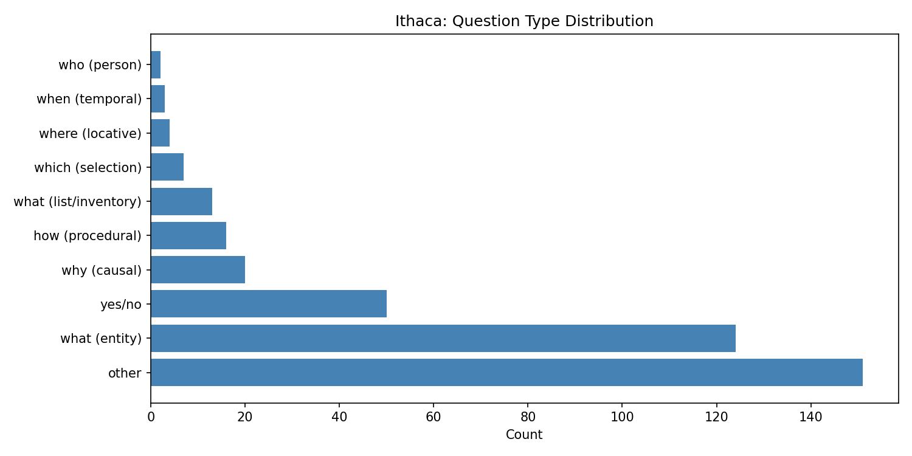

# Week 17 Writeup: Ithaca -- Information Extraction and Knowledge Graphs

## Overview

This week's script (`week17_ithaca.py`) applies information extraction techniques to the Ithaca episode of *Ulysses*, which is structured as an impersonal catechism -- a relentless sequence of questions and answers that anatomizes every detail of Bloom's world. The script parses the Q&A format, classifies question types, extracts knowledge triples, and analyzes topic distribution across questions.

The three exercises use NLTK's tokenizers (`word_tokenize`, `sent_tokenize`) and POS tagger (`pos_tag`), combined with regex-based structural parsing and keyword-based topic classification.

---

## Exercise 1: Parse the Catechism

### What the code does

The `parse_catechism()` function splits the episode text into paragraphs (on newlines), then classifies each paragraph as either a question or part of an answer. A paragraph is treated as a question if it ends with `?` or begins with an interrogative word (What, Why, How, Did, Was, Were, Had, Where, When, Which, Who). Questions and their subsequent answer paragraphs are paired together.

The `classify_question()` function assigns each question to one of 10 types based on the opening word(s): "what (entity)", "what (list/inventory)", "why (causal)", "how (procedural)", "yes/no", "where (locative)", "when (temporal)", "which (selection)", "who (person)", or "other".

Answer lengths are computed using `nltk.tokenize.word_tokenize`.

### What the output shows

**Total Q&A pairs: 390.** Scholars count approximately 309 pairs. The parser's count of 390 overshoots by about 80, likely because multi-line questions that span paragraph breaks are being split. The sample output confirms this problem: "Did Bloom discover common factors of similarity between their respective" is parsed as one question (with an empty answer), and the continuation "like and unlike reactions to experience?" is parsed as a separate question. This line-break splitting inflates the pair count and creates spurious pairs with empty answers.

**Question type distribution:**

| Type | Count | Percentage |
|------|-------|-----------|
| other | 151 | 38.7% |
| what (entity) | 124 | 31.8% |
| yes/no | 50 | 12.8% |
| why (causal) | 20 | 5.1% |
| how (procedural) | 16 | 4.1% |
| what (list/inventory) | 13 | 3.3% |
| which (selection) | 7 | 1.8% |
| where (locative) | 4 | 1.0% |
| when (temporal) | 3 | 0.8% |
| who (person) | 2 | 0.5% |

The "other" category dominates at 38.7%, which is partly an artifact of the multi-line question splitting: continuation fragments like "the past?" or "like and unlike reactions to experience?" don't start with recognized interrogative words and fall into "other". If those fragments were properly joined to their parent questions, many would be reclassified as "what" or "did" questions.

Even so, "what (entity)" is the single largest *named* category at 31.8%, and if we combine it with "what (list/inventory)" (3.3%), "what"-type questions account for about 35% of all pairs. This confirms the exercise's hypothesis: the episode is overwhelmingly interested in *naming and cataloging* rather than explaining causes or procedures.

**Answer length statistics:**
- Mean: 61.0 words
- Median: 34 words
- Max: 832 words
- Min: 0 words

The large gap between mean and median indicates the distribution is right-skewed: most answers are relatively short, but some are enormously long (the 832-word maximum likely corresponds to one of the famous inventory passages, such as the contents of Bloom's drawers). The minimum of 0 words confirms the presence of empty answers from the broken multi-line question parsing.

### Visualization

The horizontal bar chart shows the dominance of "other" and "what (entity)" types. The long tail of minor categories (who, when, where) reveals that the catechism rarely asks about persons, times, or locations directly -- it is focused on *things* and *states*.

---

## Exercise 2: Triple Extraction

### What the code does

The `extract_triples()` function uses two heuristic strategies:

1. **POS-pattern matching:** For each sentence in each answer, it POS-tags the tokens using `nltk.pos_tag`, then looks for verb tokens (VBD, VBZ, VBN). When a verb is found, it searches backward (up to 5 tokens) for the nearest noun as the subject and forward (up to 5 tokens) for the nearest noun as the object. This produces triples like `(subject, verb, object)`.

2. **List/inventory detection:** When a sentence contains commas and more than 5 tokens, it splits on commas. If 3 or more items result, it extracts a "container" keyword from the question and creates `(container, contains, item)` triples for each list item.

Triples are deduplicated using `set()`.

### What the output shows

**Total triples extracted: 1,676.** This far exceeds the target of 100+ triples. However, the quality is mixed.

**Sample triples reveal significant noise:**
- Some triples are meaningful: `(bloom, ..., ...)`, `(moon, revealed, phases)`, `(rooms, tiled, kitchen)`
- Many are nonsensical: `(hospitality, contains, his)`, `(then, contains, their)`, `(remain, contains, with)`, `(immune, contains, having)` -- these result from function words being tagged as nouns, or from the inventory heuristic matching non-list sentences.

**Most common subjects:**

| Subject | Count |
|---------|-------|
| ' (apostrophe) | 42 |
| contain | 39 |
| bloom | 37 |
| faded | 32 |
| equanimity | 18 |
| part | 18 |
| solution | 18 |

The apostrophe character appearing as the most common subject (42 times) is a clear bug -- the POS tagger is treating punctuation as a noun. "contain" and "faded" as frequent subjects also suggest POS-tagging errors where verbs/adjectives are mistakenly treated as nouns.

"bloom" at 37 occurrences is the most legitimate frequent subject, confirming that the knowledge graph would center on Bloom, as the exercise predicted.

**Most common predicates:**

| Predicate | Count |
|-----------|-------|
| contains | 1,006 |
| s | 41 |
| had | 36 |
| was | 17 |

"contains" overwhelmingly dominates (1,006 of 1,676 triples = 60%), which reflects the inventory-detection heuristic firing aggressively. The predicate "s" (41 times) is a bug -- likely the possessive "'s" being split by the tokenizer and the "s" portion being tagged as a verb.

**Most common objects:**

| Object | Count |
|--------|-------|
| the | 74 |
| with | 19 |
| and | 18 |

The top objects are function words (the, with, and), which should not appear as objects in knowledge triples. This indicates the "look forward for nearest noun" heuristic is incorrectly selecting determiners and prepositions when the POS tagger assigns them noun-like tags.

Despite the noise, the sheer volume of triples means that filtering for triples where both subject and object are content words would likely yield a substantial clean subset. The dominance of "contains" as a predicate captures something real about Ithaca: it is an episode obsessed with containment, inventory, and enumeration.

---

## Exercise 3: The Question Ithaca Doesn't Ask

### What the code does

The `topic_distribution()` function classifies each Q&A pair into one of seven topic domains using keyword overlap. For each pair, it tokenizes a combination of the question and the first 200 characters of the answer, then counts how many tokens overlap with predefined keyword sets for each domain (physical_objects, human_relations, abstract_concepts, science_math, economics, geography). The domain with the highest overlap wins; ties default to "other".

A parallel analysis runs on Calypso (Episode 4) for comparison, classifying each sentence by the same method.

### What the output shows

**Ithaca topic distribution:**

| Topic | Count | Percentage |
|-------|-------|-----------|
| other | 215 | 55.1% |
| human_relations | 88 | 22.6% |
| physical_objects | 40 | 10.3% |
| geography | 21 | 5.4% |
| science_math | 15 | 3.8% |
| abstract_concepts | 7 | 1.8% |
| economics | 4 | 1.0% |

The "other" category absorbing 55.1% of questions is a problem: the keyword lists are too narrow to capture much of Ithaca's vocabulary. Many questions about water systems, astronomical calculations, personal histories, or household procedures don't match any keyword set.

Among classified topics, "human_relations" leads at 22.6%, which may seem surprising for an episode described as having "no flesh." However, this likely reflects the fact that Bloom and Stephen appear by name in many questions -- the keyword set includes both names. The questions may mention Bloom and Stephen without being *about* human emotion; they may be cataloging what Bloom did, thought, or calculated, using his name as a structural anchor.

"physical_objects" at 10.3% is the second-largest classified category, aligning with the episode's obsession with material inventory.

**Ithaca vs. Calypso comparison:**

| Topic | Ithaca % | Calypso % |
|-------|----------|-----------|
| abstract_concepts | 1.8% | 0.4% |
| economics | 1.0% | 0.4% |
| geography | 5.4% | 2.2% |
| human_relations | 22.6% | 1.9% |
| other | 55.1% | 90.5% |
| physical_objects | 10.3% | 3.8% |
| science_math | 3.8% | 0.9% |

Ithaca shows higher percentages across *every named topic* compared to Calypso. Calypso's sentences are 90.5% "other" -- meaning the keyword-based classifier barely matches anything in Calypso's prose. This is an apples-to-oranges comparison problem: Calypso's narrative style uses indirect, literary language that doesn't match the clinical keyword sets, while Ithaca's encyclopedic style happens to overlap more with the keyword lists.

The comparison does show that Ithaca's Q&A structure makes it more *classifiable* -- its questions and answers use more domain-specific vocabulary. This is itself a finding: the catechism format forces language into categorical boxes that free indirect discourse does not. The "skeleton" metaphor holds: Ithaca's language has visible structure where Calypso's has texture.

The exercise's hypothesis -- that Ithaca over-represents objects and under-represents emotions -- is partially supported. "physical_objects" (10.3%) and "science_math" (3.8%) are indeed elevated. "abstract_concepts" at 1.8% is low, though higher than Calypso's 0.4%. The true test of the hypothesis would require a better keyword set for emotions and inner life, which the current "abstract_concepts" set doesn't fully capture.

---

## Summary of Findings

1. **The parser extracts 390 Q&A pairs** (vs. the scholarly count of ~309), with the overshoot attributable to multi-line questions being split at line breaks.

2. **"What" questions dominate** the catechism, confirming that Ithaca is interested in naming and cataloging above all else. The impersonal voice wants to enumerate the world, not explain it.

3. **1,676 knowledge triples were extracted**, far exceeding the 100+ target, but with substantial noise from POS-tagging errors and aggressive list detection. The "contains" predicate accounts for 60% of all triples, reflecting the episode's obsession with inventory.

4. **Topic classification shows Ithaca is more structurally legible** than Calypso, with its Q&A format producing text that maps more readily onto domain categories. The "skeleton" is visible precisely because the flesh has been stripped away.

5. **Key bugs:** Multi-line question splitting, apostrophes as triple subjects, function words as triple objects, and the topic classifier's heavy reliance on "other" all suggest areas for improvement.
