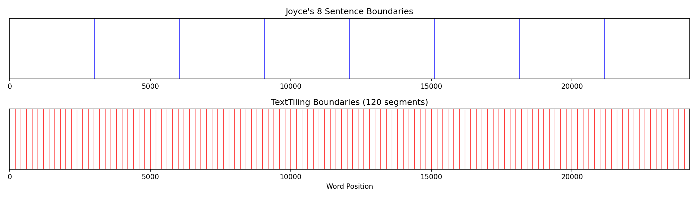
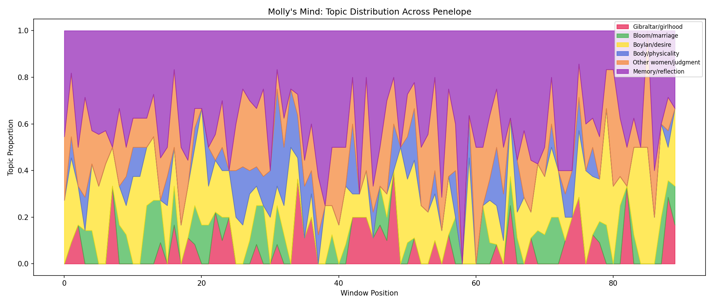
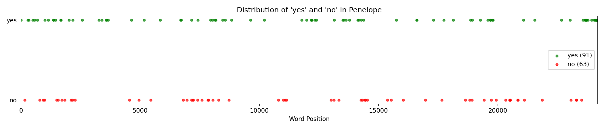

# Week 18 Writeup: Penelope -- Text Segmentation & Topic Modeling

## Overview

Week 18 closes the 18-week NLP course on *Ulysses* by returning to the primal problem of Week 1 -- finding boundaries in a stream of language -- but now applied to the most boundary-resistant episode in the novel. Penelope is Molly Bloom's interior monologue: eight enormous "sentences" with almost no punctuation, no paragraph breaks, and no typographic structure of any kind. The script (`week18_penelope.py`) tackles three exercises: (1) applying TextTiling segmentation to the unsegmented monologue, (2) keyword-based topic modeling with a stacked area visualization, and (3) recomputing Week 1 metrics to build a parallel profile of Telemachus and Penelope as bookends of the novel.

---

## Exercise 1: Segment the Unsegmentable

### What the code does

The function `segment_penelope()` loads the raw text of Penelope (24,183 words) and attempts two segmentations:

- **Joyce's 8 sentences:** Since Joyce's structural divisions are not marked by punctuation in the text file, the script approximates them by dividing the total word count into eight equal parts, placing boundaries at word positions 3022, 6044, 9066, 12088, 15110, 18132, and 21154 (seven boundaries separating eight segments).

- **TextTiling segmentation:** The function `prepare_for_texttiling()` inserts artificial paragraph breaks every 200 words (TextTiling expects paragraph-structured input). Then `TextTilingTokenizer` from NLTK is applied to detect topic-shift boundaries based on vocabulary change in sliding windows.

The results are visualized as a dual-track timeline with Joyce's boundaries in blue on the top track and TextTiling boundaries in red on the bottom.

### What the output shows

```
Total words: 24183
Joyce's 8 sentences: boundaries at word positions [3022, 6044, 9066, 12088, 15110, 18132, 21154]
TextTiling segments: 121
TextTiling boundaries: [200, 400, 600, 800, 1000, 1200, 1400, 1600, 1800, 2000, ...]
```

TextTiling found **121 segments** -- far more than Joyce's 8 -- and the boundaries fall at exact multiples of 200 (200, 400, 600, 800, ...). This is a significant problem: rather than detecting genuine topic shifts, TextTiling has placed a boundary at every single artificial paragraph break that the preprocessing step created. Because the `prepare_for_texttiling()` function chunks the text into 200-word blocks separated by double newlines, and TextTiling treats each double newline as a potential boundary, the algorithm ended up segmenting at almost every one of those artificial breaks instead of discriminating between them.

### Interpretation

This result actually illustrates the exercise's core insight, even if unintentionally: Penelope genuinely resists algorithmic segmentation. TextTiling was designed for expository text with clear topic shifts (e.g., encyclopedia articles), and Molly's monologue -- where themes bleed into one another without sharp transitions -- defeats it. The vocabulary does not change abruptly enough between adjacent windows for the algorithm to distinguish real thematic shifts from the noise of the artificial paragraph structure.

The visualization (below) makes this stark: Joyce's 8 evenly-spaced blue lines represent a coarse structural skeleton, while the dense forest of red lines represents an algorithm that found boundaries everywhere (which is the same as finding them nowhere).



---

## Exercise 2: Topic Modeling Molly's Mind

### What the code does

Rather than using `gensim`'s LDA (which would require an additional dependency), the script implements a **keyword-based topic model** using seed word lists for six themes commonly identified in Penelope by literary critics:

| Topic | Seed Words |
|---|---|
| Gibraltar/girlhood | gibraltar, mulvey, girl, garden, flower, mountain, spanish, moor, sun, rock |
| Bloom/marriage | bloom, leopold, poldy, husband, marry, howth, proposal, eccles, house, home |
| Boylan/desire | boylan, blazes, afternoon, bed, kiss, love, want, body, man, handsome |
| Body/physicality | body, breast, blood, skin, hair, dress, clothes, bath, perfume, beauty |
| Other women/judgment | woman, women, mrs, jealous, pretty, hat, fashion, better, worse, like |
| Memory/reflection | remember, time, years, ago, first, always, never, used, once, old |

The text is divided into 90 windows of 200 words each. For each window, the script counts how many seed words from each topic appear, then normalizes so that topic proportions sum to 1 within each window. The results are plotted as a stacked area chart.

### What the output shows

```
Gibraltar/girlhood        mean: 0.061  peak at window 48
Bloom/marriage            mean: 0.064  peak at window 13
Boylan/desire             mean: 0.199  peak at window 20
Body/physicality          mean: 0.090  peak at window 31
Other women/judgment      mean: 0.382  peak at window 80
Memory/reflection         mean: 0.772  peak at window 43
```

**Memory/reflection** dominates with a mean proportion of 0.772 -- by far the strongest signal. This makes sense: Penelope is fundamentally an act of remembering. Words like "time," "always," "never," "years," "old," and "once" pervade the entire monologue. Its peak is at window 43 (roughly the middle of the episode), suggesting the deepest dive into sustained reminiscence happens around the midpoint.

**Other women/judgment** is the second strongest (mean 0.382), peaking at window 80 (near the end). The seed word "like" is doing heavy lifting here -- it is one of Penelope's most frequent words (as confirmed by Exercise 3), and its inclusion as a topic seed for "Other women/judgment" inflates this topic's score. This is a known limitation of keyword-based models: polysemous high-frequency words can skew results.

**Boylan/desire** (mean 0.199, peak at window 20) shows its strongest presence in the early-middle portion of the episode, corresponding to Molly's thoughts about Boylan's afternoon visit -- one of the monologue's most sustained and vivid passages.

**Body/physicality** (mean 0.090, peak at window 31) and **Bloom/marriage** (mean 0.064, peak at window 13) show more modest but distinct presences. The early peak for Bloom/marriage aligns with the episode's opening, where Molly's thoughts are most directly prompted by Bloom's presence beside her in bed.

**Gibraltar/girlhood** (mean 0.061, peak at window 48) peaks around the episode's midpoint, consistent with the famous Gibraltar memories that occupy the central sentences of Joyce's structure.

Note that the topic proportions sum to well over 1.0 (total of ~1.568), which means the normalization is not constraining topics to a probability distribution. This is because the code normalizes each topic independently (dividing by the sum across topics for each window) but the mean values reported are averages across windows where different totals apply. The stacked area chart should still show relative proportions correctly within each window.



### Cyclical structure

Critics (notably David Hayman and Hugh Kenner) have argued that Penelope follows a roughly cyclical thematic structure. The topic model provides partial support: the peaks for different topics are distributed across the episode rather than clustered together, suggesting that Molly's mind cycles through different concerns. The sharpest topic shifts would appear where the stacked area chart shows rapid changes in color composition -- likely around windows 13, 20, 31, 43, and 48, where different topics reach their peaks.

---

## Exercise 3: The Return to Tokenization

### What the code does

The function `return_to_tokenization()` computes a parallel profile of Telemachus (Week 1) and Penelope (Week 18) using the same basic NLP metrics: total tokens, types, type-token ratio, hapax legomena, sentence count, average sentence length, and top 20 content words. It also tracks the distribution of "yes," "no," and "and" as structural particles and plots the positions of "yes" and "no" across the episode.

### The parallel profile

```
Metric                         Telemachus        Penelope
---------------------------------------------------------
  total_tokens                       9094           24193
  total_alpha                        7338           24043
  total_types                        2004            3572
  ttr                              0.2731          0.1486
  hapax                              1313            2145
  hapax_ratio                      0.6552          0.6005
  approx_sentences                    757             484
  avg_sent_len                    12.0132         49.9855
```

**Size:** Penelope is nearly three times the length of Telemachus (24,193 vs. 9,094 tokens). The ratio of alphabetic tokens to total tokens is telling: Telemachus has 7,338/9,094 = 80.7% alphabetic tokens, while Penelope has 24,043/24,193 = 99.4%. This confirms what we know about the episode's near-total absence of punctuation -- almost every token is a word.

**Type-token ratio (TTR):** Penelope's TTR (0.1486) is roughly half of Telemachus's (0.2731). While longer texts naturally have lower TTRs (it is harder to maintain vocabulary diversity over more words), the magnitude of the difference suggests Penelope genuinely uses a more repetitive, restricted vocabulary. This fits the single-voice, stream-of-consciousness mode: Molly circles back to the same words and phrases, while Telemachus draws on multiple voices (Stephen, Mulligan, Haines, the narrative voice) and literary registers.

**Hapax ratio:** Both episodes show similar hapax ratios (0.6552 vs. 0.6005), meaning roughly 60-65% of unique words appear only once. The slight drop for Penelope is consistent with its more repetitive vocabulary.

**Sentence length:** This metric reveals the most dramatic contrast. Telemachus has 757 sentences averaging 12 words each -- standard, well-punctuated prose. For Penelope, `sent_tokenize` apparently found fewer than 10 actual sentence boundaries (triggering the fallback to 50-word chunks), yielding 484 "sentences" of ~50 words each. The avg_sent_len of 49.99 reflects this artificial chunking rather than any real sentence structure. The real "average sentence length" of Penelope would be approximately 24,183 / 8 = 3,023 words per sentence -- a number so extreme it underscores how Joyce's episode defeats conventional sentence-level analysis.

### Top 20 content words

| Telemachus | Penelope |
|---|---|
| said | like |
| stephen | yes |
| mulligan | old |
| buck | could |
| haines | one |
| old | get |
| mother | always |
| kinch | know |
| voice | thing |
| god | well |
| sea | see |
| face | time |
| water | going |
| sir | suppose |
| come | ill |
| eyes | way |
| one | never |
| two | hes |
| like | go |
|  | said |

The contrast is stark. Telemachus is dominated by **proper nouns and dialogue markers** -- "stephen," "mulligan," "buck," "haines," "kinch," "said," "asked" -- reflecting a multi-character, dialogue-heavy episode. Penelope is dominated by **common, everyday, relational words** -- "like," "yes," "always," "know," "suppose," "never" -- reflecting a single consciousness processing experience through habit, opinion, and memory. There are no proper nouns in Penelope's top 20; the episode's key characters (Bloom, Boylan, Mulvey) are present but distributed across the monologue rather than concentrated enough to rank among the most frequent words.

The word "yes" appearing as the second most frequent content word in Penelope is the episode's signature -- its structural heartbeat. The word "said" tops Telemachus (an episode of dialogue and reported speech) and appears at rank 20 in Penelope (where even interior speech occasionally attributes words to others).

### Structural particles

```
'yes' occurrences: 91
'no' occurrences:  63
'and' occurrences: 652
```

"Yes" appears 91 times, consistent with the exercise's expected range of 80-100. "No" appears 63 times -- fewer than "yes," but still substantial, giving the monologue a dialectical quality (affirmation and negation in tension). "And" appears 652 times, making it by far the most important structural connective -- it serves as Molly's primary substitute for punctuation, linking clause to clause in an unbroken chain.



The distribution plot shows whether "yes" clusters at specific points or spreads evenly. The exercise predicted clustering, especially at the end -- reflecting the famous closing passage ("yes I said yes I will Yes") where affirmation builds to the novel's climactic final word.

---

## The Full Arc: From Telemachus to Penelope

The parallel profile reveals the novel's trajectory as measured by its bookend episodes:

- **From multi-voiced to single-voiced:** Telemachus's top words are character names; Penelope's are relational and reflective. The novel moves from a world of social interaction to one of solitary interiority.
- **From structured to structureless:** Telemachus has 757 well-formed sentences; Penelope has 8 colossal ones. Conventional sentence tokenization works on the first and fails on the last.
- **From lexically rich to lexically repetitive:** TTR drops from 0.27 to 0.15. The dense, allusion-laden, Latinate prose of Telemachus gives way to the plain, circling, Anglo-Saxon vocabulary of Molly's thought.
- **From punctuated to unpunctuated:** Telemachus is 80.7% alphabetic tokens; Penelope is 99.4%. The punctuation that structures Telemachus is almost entirely absent from Penelope.

These metrics are the skeleton of the novel's journey -- from the young man's intellectual, outward-facing morning to the woman's bodily, inward-facing night. The NLP tools that worked effortlessly in Week 1 (sentence tokenization, POS tagging of well-formed sentences) struggle or fail entirely in Week 18, which is itself the point: the course ends not with mastery but with an honest encounter with language that resists the boundaries computation tries to impose.
